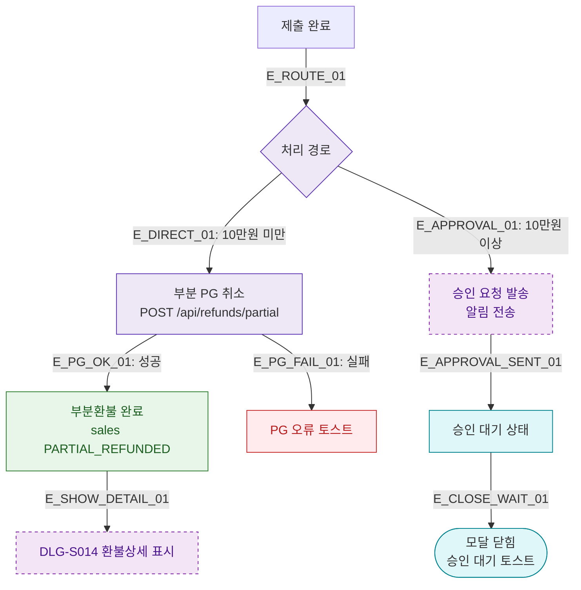

## 1. 목적
DLG-S015 부분환불 처리 후 승인 대기 또는 즉시 완료 분기를 표현한다.

## 2. 전제조건
- DLG-S015에서 제출 완료

## 3. 다이어그램

## 4. 엣지 설명

| 엣지 ID | 출발 | 도착 | 설명 |
|---------|------|------|------|
| E_DIRECT_01 | ROUTE | PG_PARTIAL | 즉시 부분 PG 취소 |
| E_APPROVAL_01 | ROUTE | SEND_APPROVAL | 승인 요청 발송 |
| E_PG_OK_01 | PG_PARTIAL | PARTIAL_DONE | PG 성공 → 부분환불 완료 |
| E_SHOW_DETAIL_01 | PARTIAL_DONE | DLG_S014 | 환불 상세 모달 표시 |

## 5. TC 후보

| TC ID | 타입 | Given | When | Then |
|-------|------|-------|------|------|
| TC-S012-DLG015-M3-01 | positive | 5만원 부분환불 | 제출 | 즉시 처리, DLG-S014 표시 |
| TC-S012-DLG015-M3-02 | positive | 15만원 부분환불 | 제출 | 승인 요청 발송, 대기 토스트 |
| TC-S012-DLG015-M3-03 | exception | PG 취소 요청 | PG 실패 | PG 오류 토스트 |
