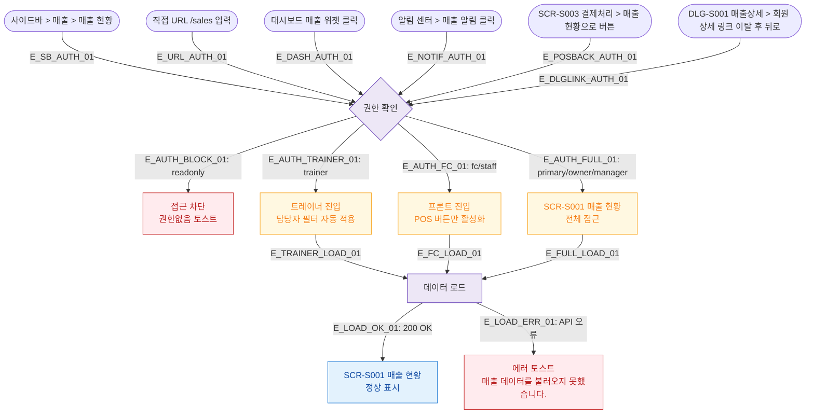

## 1. 목적
SCR-S001 매출 현황 화면으로 진입 가능한 모든 경로를 정의하고, 진입 시 권한 분기를 표현한다.

## 2. 전제조건
- 사용자가 로그인된 상태
- 세션 유효

## 3. 다이어그램

## 4. 엣지 설명

| 엣지 ID | 출발 | 도착 | 설명 |
|---------|------|------|------|
| E_SB_AUTH_01 | 사이드바 | AUTH | 사이드바 매출 메뉴 클릭 |
| E_URL_AUTH_01 | URL | AUTH | 직접 /sales URL 진입 |
| E_DASH_AUTH_01 | 대시보드 위젯 | AUTH | 대시보드 매출 위젯 클릭 |
| E_NOTIF_AUTH_01 | 알림 센터 | AUTH | 매출 관련 알림 클릭 |
| E_POSBACK_AUTH_01 | SCR-S003 | AUTH | 결제 완료 후 매출 현황으로 이동 |
| E_AUTH_BLOCK_01 | AUTH | BLOCKED | readonly 역할 차단 |
| E_AUTH_TRAINER_01 | AUTH | TRAINER_FILTER | 트레이너 — 담당자 필터 자동 적용 |
| E_AUTH_FC_01 | AUTH | FC_VIEW | 프론트 — POS 버튼만 활성 |
| E_AUTH_FULL_01 | AUTH | FULL | 관리자급 전체 접근 |
| E_LOAD_OK_01 | LOAD | S001 | 데이터 로드 성공 |
| E_LOAD_ERR_01 | LOAD | ERR | 데이터 로드 실패 |

## 5. TC 후보

| TC ID | 타입 | Given | When | Then |
|-------|------|-------|------|------|
| TC-S001-F1-01 | positive | 매니저 로그인 | 사이드바 > 매출 현황 클릭 | SCR-S001 정상 진입 |
| TC-S001-F1-02 | positive | 트레이너 로그인 | 매출 현황 진입 | 담당자 필터 자동 적용 배너 표시 |
| TC-S001-F1-03 | negative | readonly 역할 | /sales URL 직접 입력 | 접근 차단, 권한없음 토스트 |
| TC-S001-F1-04 | positive | 프론트 로그인 | 매출 현황 진입 | POS 판매 버튼만 활성화 |
| TC-S001-F1-05 | exception | 매니저 로그인 | API 응답 오류 | 에러 토스트 표시 |
