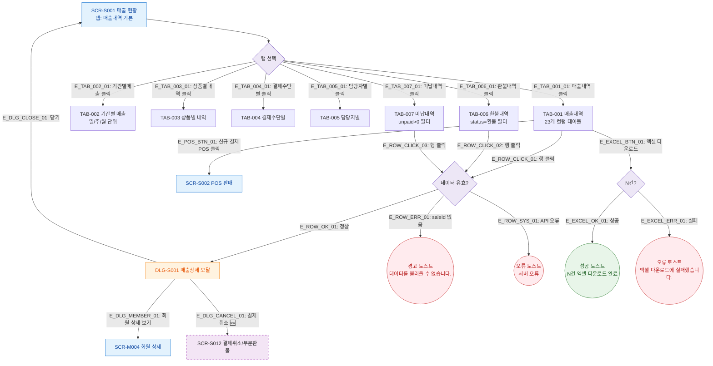

## 1. 목적
SCR-S001 매출 현황의 7개 탭 전환 및 핵심 인터랙션 Happy Path를 표현한다. 탭 전환, 행 클릭, 버튼 동작의 3갈래 분기(성공/검증실패/시스템에러)를 포함한다.

## 2. 전제조건
- 로그인 완료, 매출 현황 진입 완료
- 기본 탭: TAB-001 매출내역

## 3. 다이어그램

## 4. 엣지 설명

| 엣지 ID | 출발 | 도착 | 설명 |
|---------|------|------|------|
| E_TAB_001_01 ~ E_TAB_007_01 | TABSELECT | TAB00X | 각 탭 클릭 전환 |
| E_ROW_CLICK_01~03 | TAB001/006/007 | VALID_ROW | 행 클릭 (TAB-002~005는 행 클릭 없음) |
| E_ROW_OK_01 | VALID_ROW | DLG_S001 | 정상 행 클릭 → 매출 상세 모달 |
| E_ROW_ERR_01 | VALID_ROW | TOAST_WARN | saleId 없음 |
| E_ROW_SYS_01 | VALID_ROW | TOAST_ERR | API 오류 |
| E_DLG_CLOSE_01 | DLG_S001 | S001 | 모달 닫기 → 원래 화면 유지 |
| E_DLG_MEMBER_01 | DLG_S001 | SCR_M004 | 회원 상세 이동 |
| E_DLG_CANCEL_01 | DLG_S001 | SCR_S012 | 결제 취소 페이지 이동 (🆕) |
| E_EXCEL_OK_01 | EXCEL_CHECK | TOAST_EXCEL | 다운로드 성공 |
| E_EXCEL_ERR_01 | EXCEL_CHECK | TOAST_EXCEL_ERR | 다운로드 실패 |

## 5. TC 후보

| TC ID | 타입 | Given | When | Then |
|-------|------|-------|------|------|
| TC-S001-F2-01 | positive | 매출 현황 진입 | TAB-001 행 클릭 | DLG-S001 매출 상세 모달 표시 |
| TC-S001-F2-02 | positive | 매출 현황 진입 | 기간별 탭 클릭 | TAB-002 기간별 집계 테이블 표시 |
| TC-S001-F2-03 | positive | 매출 현황 진입 | 엑셀 다운로드 클릭 | N건 엑셀 다운로드 완료 토스트 |
| TC-S001-F2-04 | positive | 매출 현황 진입 | 신규 결제 POS 클릭 | SCR-S002 POS 판매 이동 |
| TC-S001-F2-05 | exception | 매출 현황 진입 | 엑셀 다운로드 API 실패 | 에러 토스트 표시 |
