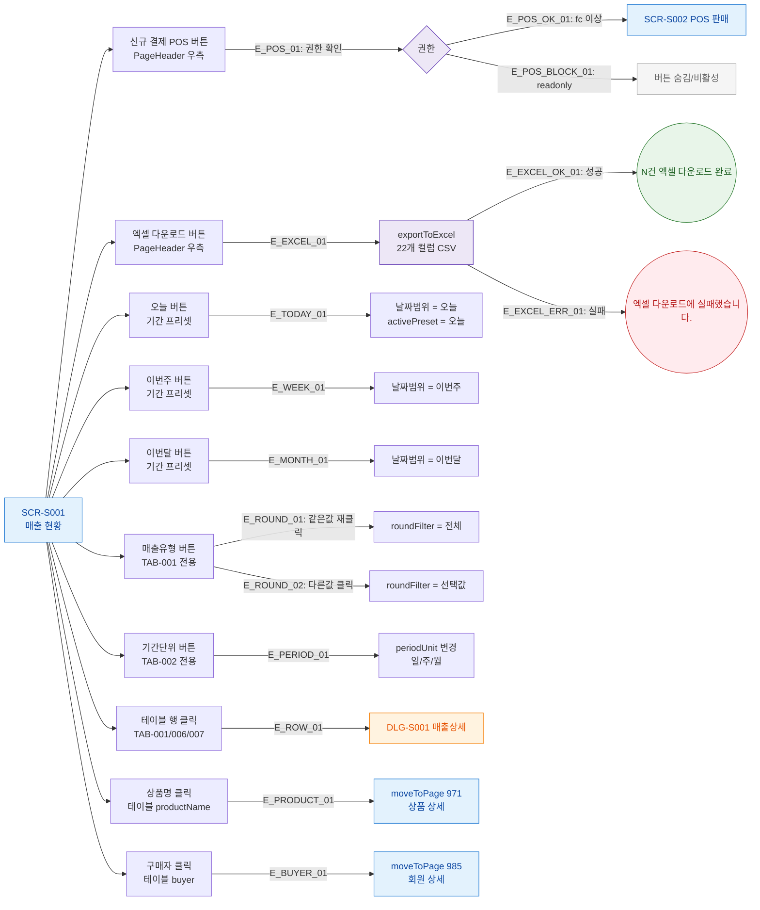

## 1. 목적
SCR-S001의 모든 버튼과 클릭 가능한 요소를 노드화하여 각 동작을 매핑한다.

## 2. 전제조건
- SCR-S001 진입 완료

## 3. 다이어그램

## 4. 엣지 설명

| 엣지 ID | 출발 | 도착 | 설명 |
|---------|------|------|------|
| E_POS_01 | BTN_POS | POS_AUTH | POS 버튼 클릭 시 권한 확인 |
| E_POS_OK_01 | POS_AUTH | SCR_S002 | fc 이상 → POS 판매 이동 |
| E_POS_BLOCK_01 | POS_AUTH | BLOCKED_POS | readonly → 버튼 비활성 |
| E_EXCEL_OK_01 | EXCEL_PROC | TOAST_EXCEL | 엑셀 다운로드 성공 |
| E_EXCEL_ERR_01 | EXCEL_PROC | TOAST_EXCEL_ERR | 엑셀 다운로드 실패 |
| E_ROW_01 | ROW_CLICK | DLG_S001 | 행 클릭 → 매출 상세 모달 |
| E_PRODUCT_01 | PRODUCT_CLICK | PAGE_971 | 상품명 클릭 → 상품 상세 |
| E_BUYER_01 | BUYER_CLICK | PAGE_985 | 구매자 클릭 → 회원 상세 |

## 5. TC 후보

| TC ID | 타입 | Given | When | Then |
|-------|------|-------|------|------|
| TC-S001-F3-01 | positive | 매니저 로그인 | 신규 결제 POS 버튼 클릭 | SCR-S002 이동 |
| TC-S001-F3-02 | positive | 매출 현황 TAB-001 | 행 클릭 | DLG-S001 표시 |
| TC-S001-F3-03 | positive | 매출 현황 TAB-001 | 상품명 클릭 | 상품 상세(971) 이동 |
| TC-S001-F3-04 | positive | 매출 현황 TAB-001 | 구매자 클릭 | 회원 상세(985) 이동 |
| TC-S001-F3-05 | positive | TAB-001 | 매출유형 버튼 같은 값 재클릭 | 전체 필터로 복귀 |
| TC-S001-F3-06 | negative | readonly 로그인 | POS 버튼 확인 | 버튼 숨김 또는 비활성 |
