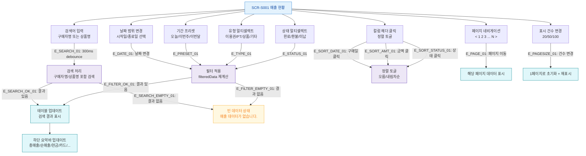

## 1. 목적
SCR-S001의 필터, 검색, 정렬, 페이지네이션 각 액션과 조합 시나리오를 표현한다.

## 2. 전제조건
- SCR-S001 진입 완료, 기본 필터: 이번달, TAB-001

## 3. 다이어그램

## 4. 엣지 설명

| 엣지 ID | 출발 | 도착 | 설명 |
|---------|------|------|------|
| E_DATE_01 | FILTER_DATE | APPLY_FILTER | 날짜 범위 변경 시 자동 필터 |
| E_PRESET_01 | FILTER_PRESET | APPLY_FILTER | 기간 프리셋 버튼 클릭 |
| E_SEARCH_01 | SEARCH_INPUT | SEARCH_PROC | 300ms debounce 후 검색 |
| E_SEARCH_OK_01 | SEARCH_PROC | TABLE_UPDATE | 검색 결과 있음 |
| E_SEARCH_EMPTY_01 | SEARCH_PROC | EMPTY | 검색 결과 없음 |
| E_FILTER_EMPTY_01 | APPLY_FILTER | EMPTY | 필터 결과 없음 |
| E_SORT_DATE_01 | SORT_COL | SORT_TOGGLE | 구매일 정렬 토글 |
| E_PAGE_01 | PAGE_NAV | PAGE_LOAD | 페이지 이동 |
| E_PAGESIZE_01 | PAGE_SIZE | PAGE_RESET | 표시 건수 변경 → 1페이지 초기화 |

## 5. TC 후보

| TC ID | 타입 | Given | When | Then |
|-------|------|-------|------|------|
| TC-S001-F4-01 | positive | 매출 현황 | 날짜 범위를 지난달로 변경 | 해당 기간 데이터만 표시, 요약바 업데이트 |
| TC-S001-F4-02 | positive | 매출 현황 | 구매자명 검색 | 300ms 후 결과 필터링 |
| TC-S001-F4-03 | positive | 매출 현황 | 구매일 컬럼 클릭 | 정렬 방향 토글 |
| TC-S001-F4-04 | positive | 매출 현황 | 표시 건수를 100으로 변경 | 1페이지로 초기화, 최대 100건 표시 |
| TC-S001-F4-05 | negative | 매출 현황 | 결과 없는 검색어 입력 | 빈 데이터 메시지 표시 |
