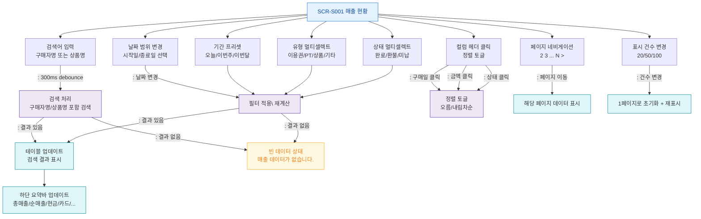

## 1. 목적
SCR-S001의 필터, 검색, 정렬, 페이지네이션 각 액션과 조합 시나리오를 표현한다.

## 2. 전제조건
- SCR-S001 진입 완료, 기본 필터: 이번달, TAB-001

## 3. 다이어그램

## 4. 엣지 설명

| 출발 | 도착 | 설명 | |---------|------|------|------| | | FILTER_DATE | APPLY_FILTER | 날짜 범위 변경 시 자동 필터 | | | FILTER_PRESET | APPLY_FILTER | 기간 프리셋 버튼 클릭 | | | SEARCH_INPUT | SEARCH_PROC | 300ms debounce 후 검색 | | | SEARCH_PROC | TABLE_UPDATE | 검색 결과 있음 | | | SEARCH_PROC | EMPTY | 검색 결과 없음 | | | APPLY_FILTER | EMPTY | 필터 결과 없음 | | | SORT_COL | SORT_TOGGLE | 구매일 정렬 토글 | | | PAGE_NAV | PAGE_LOAD | 페이지 이동 | | | PAGE_SIZE | PAGE_RESET | 표시 건수 변경 → 1페이지 초기화 |
