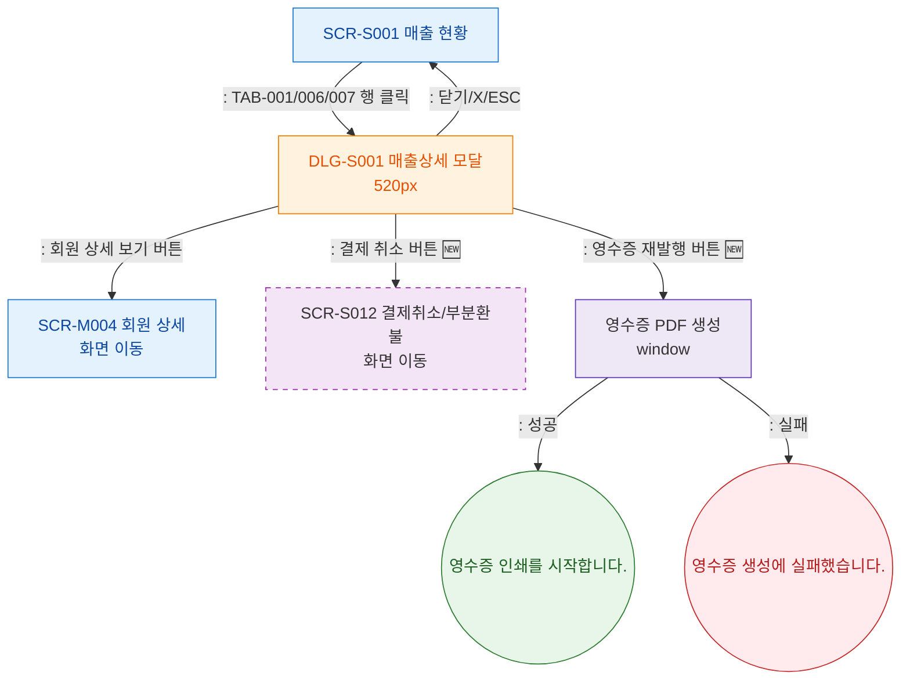

## 1. 목적
SCR-S001에서 발생하는 모달 트리거 경로를 트리 형태로 표현한다.

## 2. 전제조건
- SCR-S001 진입 완료

## 3. 다이어그램

## 4. 엣지 설명

| 출발 | 도착 | 설명 | |---------|------|------|------| | | S001 | DLG_S001 | TAB-001/006/007 행 클릭 | | | DLG_S001 | SCR_M004 | 회원 상세 보기 | | | DLG_S001 | SCR_S012 | 결제 취소 (🆕) | | | DLG_S001 | RECEIPT_PROC | 영수증 재발행 (🆕) | | | DLG_S001 | S001 | 닫기/X/ESC | | | RECEIPT_PROC | TOAST_RECEIPT_OK | 영수증 출력 성공 | | | RECEIPT_PROC | TOAST_RECEIPT_ERR | 영수증 생성 실패 |
