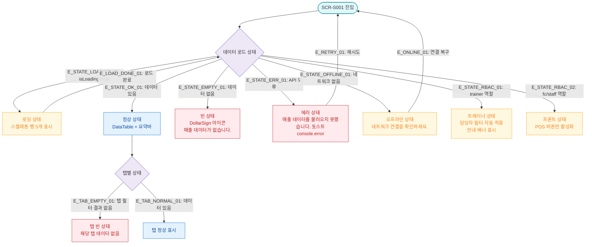

## 1. 목적
SCR-S001의 로딩/빈/에러/권한없음/오프라인 등 모든 UI 상태를 표현한다.

## 2. 전제조건
- SCR-S001 진입 시도

## 3. 다이어그램

## 4. 엣지 설명

| 엣지 ID | 출발 | 도착 | 설명 |
|---------|------|------|------|
| E_STATE_LOADING_01 | LOAD_STATE | SKELETON | isLoading=true → 스켈레톤 |
| E_STATE_OK_01 | LOAD_STATE | NORMAL | 정상 데이터 로드 |
| E_STATE_EMPTY_01 | LOAD_STATE | EMPTY | 데이터 0건 |
| E_STATE_ERR_01 | LOAD_STATE | ERROR | API 오류 |
| E_STATE_OFFLINE_01 | LOAD_STATE | OFFLINE | 네트워크 없음 |
| E_STATE_RBAC_01 | LOAD_STATE | TRAINER_STATE | 트레이너 자동 필터 |
| E_STATE_RBAC_02 | LOAD_STATE | FC_STATE | 프론트 제한 |
| E_RETRY_01 | ERROR | ENTRY | 재시도 |
| E_ONLINE_01 | OFFLINE | ENTRY | 연결 복구 후 재시도 |

## 5. TC 후보

| TC ID | 타입 | Given | When | Then |
|-------|------|-------|------|------|
| TC-S001-F6-01 | positive | 매출 현황 진입 | 데이터 로드 중 | 스켈레톤 5행 표시 |
| TC-S001-F6-02 | positive | 매출 현황 진입 | 해당 기간 데이터 없음 | 빈 상태 메시지 표시 |
| TC-S001-F6-03 | exception | 매출 현황 진입 | API 500 오류 | 에러 토스트 표시 |
| TC-S001-F6-04 | positive | 트레이너 로그인 | 매출 현황 진입 | 담당자 필터 자동 적용 배너 |
| TC-S001-F6-05 | exception | 매출 현황 진입 | 네트워크 오프라인 | 오프라인 안내 표시 |
