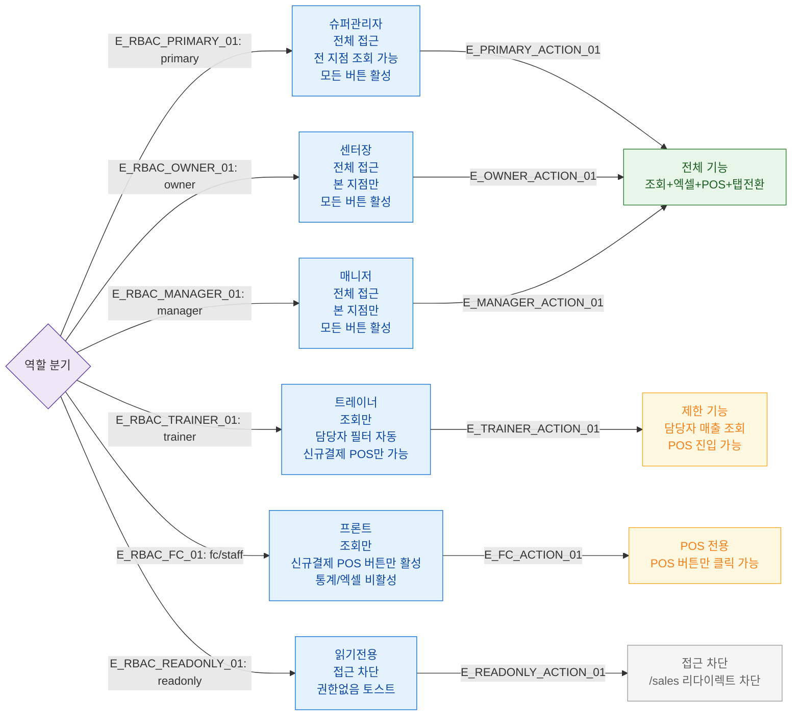

## 1. 목적
SCR-S001에서 6개 역할별 접근 가능 범위와 제한 사항을 표현한다.

## 2. 전제조건
- 로그인 완료

## 3. 다이어그램

## 4. 엣지 설명

| 엣지 ID | 출발 | 도착 | 설명 |
|---------|------|------|------|
| E_RBAC_PRIMARY_01 | AUTH | PRIMARY | 슈퍼관리자 분기 |
| E_RBAC_OWNER_01 | AUTH | OWNER | 센터장 분기 |
| E_RBAC_MANAGER_01 | AUTH | MANAGER | 매니저 분기 |
| E_RBAC_TRAINER_01 | AUTH | TRAINER | 트레이너 분기 — 담당자 자동 필터 |
| E_RBAC_FC_01 | AUTH | FC | 프론트 분기 — POS만 활성 |
| E_RBAC_READONLY_01 | AUTH | READONLY | 읽기전용 — 접근 차단 |

## 5. TC 후보

| TC ID | 타입 | Given | When | Then |
|-------|------|-------|------|------|
| TC-S001-F7-01 | positive | primary 로그인 | 매출 현황 진입 | 전체 기능 활성, 전 지점 조회 |
| TC-S001-F7-02 | positive | trainer 로그인 | 매출 현황 진입 | 담당자 필터 자동, 안내 배너 |
| TC-S001-F7-03 | positive | fc 로그인 | 매출 현황 진입 | POS 버튼만 활성 |
| TC-S001-F7-04 | negative | readonly 로그인 | /sales 접근 | 접근 차단, 권한없음 토스트 |
| TC-S001-F7-05 | positive | trainer 로그인 | 엑셀 다운로드 | 담당자 필터 적용된 데이터만 다운로드 |
| TC-S001-F7-06 | positive | manager 로그인 | 매출 현황 진입 | 전체 접근, 본 지점 데이터만 |
