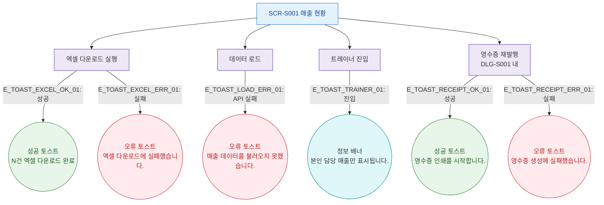

## 1. 목적
SCR-S001에서 발생하는 모든 토스트/피드백 메시지의 발생 조건을 표현한다.

## 2. 전제조건
- SCR-S001 진입 완료

## 3. 다이어그램

## 4. 엣지 설명

| 엣지 ID | 출발 | 도착 | 토스트 타입 | 메시지 |
|---------|------|------|-------------|--------|
| E_TOAST_EXCEL_OK_01 | EVT_EXCEL | TOAST_S_EXCEL | success | N건 엑셀 다운로드 완료 |
| E_TOAST_EXCEL_ERR_01 | EVT_EXCEL | TOAST_E_EXCEL | error | 엑셀 다운로드에 실패했습니다. |
| E_TOAST_LOAD_ERR_01 | EVT_LOAD | TOAST_E_LOAD | error | 매출 데이터를 불러오지 못했습니다. |
| E_TOAST_TRAINER_01 | EVT_TRAINER | TOAST_I_TRAINER | info | 본인 담당 매출만 표시됩니다. |
| E_TOAST_RECEIPT_OK_01 | EVT_RECEIPT | TOAST_S_RECEIPT | success | 영수증 인쇄를 시작합니다. |
| E_TOAST_RECEIPT_ERR_01 | EVT_RECEIPT | TOAST_E_RECEIPT | error | 영수증 생성에 실패했습니다. |

## 5. TC 후보

| TC ID | 타입 | Given | When | Then |
|-------|------|-------|------|------|
| TC-S001-F9-01 | positive | 매출 현황 | 엑셀 다운로드 성공 | success 토스트 "N건 엑셀 다운로드 완료" |
| TC-S001-F9-02 | exception | 매출 현황 | 데이터 로드 실패 | error 토스트 표시 |
| TC-S001-F9-03 | positive | 트레이너 로그인 | 매출 현황 진입 | info 배너 "본인 담당 매출만 표시됩니다." |
| TC-S001-F9-04 | positive | DLG-S001 열림 | 영수증 재발행 성공 | success 토스트 "영수증 인쇄를 시작합니다." |
