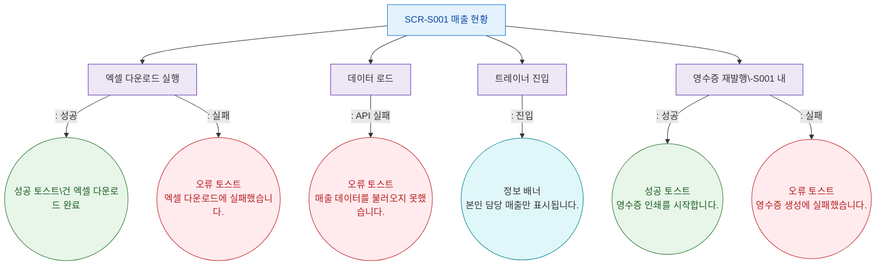

## 1. 목적
SCR-S001에서 발생하는 모든 토스트/피드백 메시지의 발생 조건을 표현한다.

## 2. 전제조건
- SCR-S001 진입 완료

## 3. 다이어그램

## 4. 엣지 설명

| 출발 | 도착 | 토스트 타입 | 메시지 | |---------|------|------|-------------|--------| | | EVT_EXCEL | TOAST_S_EXCEL | success | N건 엑셀 다운로드 완료 | | | EVT_EXCEL | TOAST_E_EXCEL | error | 엑셀 다운로드에 실패했습니다. | | | EVT_LOAD | TOAST_E_LOAD | error | 매출 데이터를 불러오지 못했습니다. | | | EVT_TRAINER | TOAST_I_TRAINER | info | 본인 담당 매출만 표시됩니다. | | | EVT_RECEIPT | TOAST_S_RECEIPT | success | 영수증 인쇄를 시작합니다. | | | EVT_RECEIPT | TOAST_E_RECEIPT | error | 영수증 생성에 실패했습니다. |
