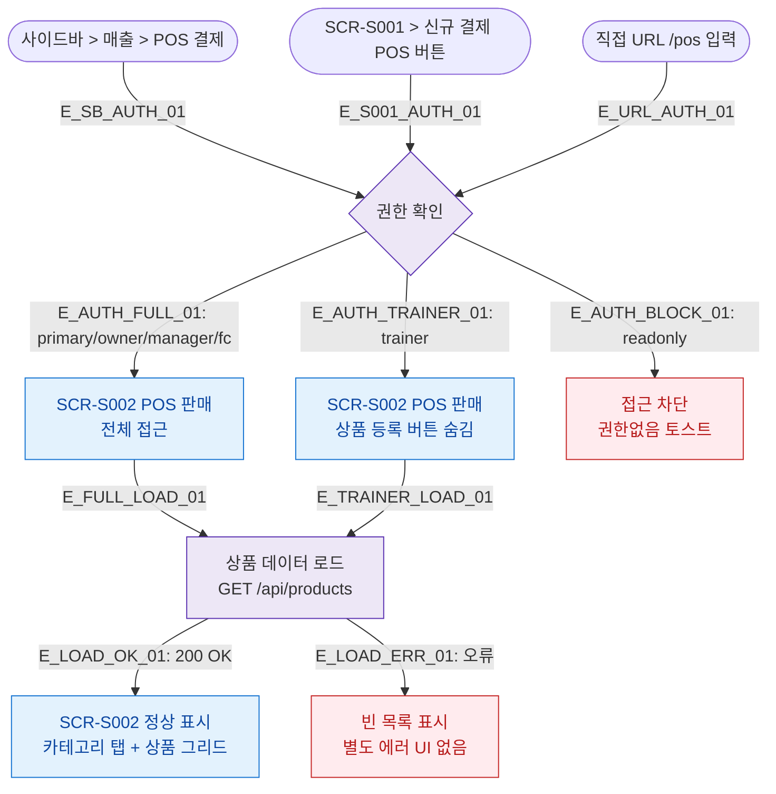

## 1. 목적
SCR-S002 POS 판매 화면의 모든 진입 경로와 권한 분기를 표현한다.

## 2. 전제조건
- 로그인 완료

## 3. 다이어그램

## 4. 엣지 설명

| 엣지 ID | 출발 | 도착 | 설명 |
|---------|------|------|------|
| E_SB_AUTH_01 | 사이드바 | AUTH | 사이드바 POS 결제 클릭 |
| E_S001_AUTH_01 | SCR-S001 버튼 | AUTH | 신규 결제 POS 버튼 클릭 |
| E_AUTH_FULL_01 | AUTH | FULL | 관리자/프론트 전체 접근 |
| E_AUTH_TRAINER_01 | AUTH | TRAINER | 트레이너 — 상품 등록 숨김 |
| E_AUTH_BLOCK_01 | AUTH | BLOCKED | readonly 차단 |
| E_LOAD_OK_01 | LOAD | S002 | 상품 데이터 로드 성공 |
| E_LOAD_ERR_01 | LOAD | ERR | 로드 실패 → 빈 목록 |

## 5. TC 후보

| TC ID | 타입 | Given | When | Then |
|-------|------|-------|------|------|
| TC-S002-F1-01 | positive | 매니저 로그인 | 사이드바 POS 클릭 | SCR-S002 정상 진입 |
| TC-S002-F1-02 | positive | 트레이너 로그인 | POS 진입 | 상품 등록 버튼 숨김 확인 |
| TC-S002-F1-03 | positive | fc 로그인 | SCR-S001 신규 결제 POS 클릭 | SCR-S002 이동 |
