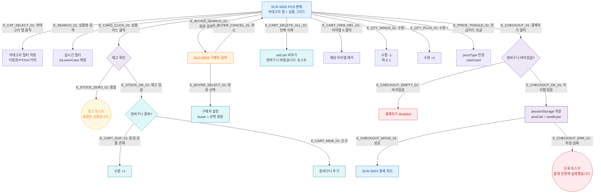

## 1. 목적
POS 판매의 Happy Path — 상품 선택 → 장바구니 담기 → 구매자 검색 → 결제하기 흐름. 성공/검증실패/시스템에러 3갈래 분기 포함.

## 2. 전제조건
- SCR-S002 진입 완료, 상품 목록 로드됨

## 3. 다이어그램

## 4. 엣지 설명

| 엣지 ID | 출발 | 도착 | 설명 |
|---------|------|------|------|
| E_CARD_CLICK_01 | S002 | STOCK_CHECK | 상품 카드 클릭 |
| E_STOCK_ZERO_01 | STOCK_CHECK | TOAST_SOLDOUT | 품절 상품 클릭 |
| E_STOCK_OK_01 | STOCK_CHECK | CART_ADD | 재고 있음 → 장바구니 처리 |
| E_CART_DUP_01 | CART_ADD | CART_QTY | 동일 상품 → 수량 +1 |
| E_CART_NEW_01 | CART_ADD | CART_NEW | 신규 상품 → 장바구니 추가 |
| E_BUYER_SEARCH_01 | S002 | DLG_S002 | 구매자 검색 모달 오픈 |
| E_CHECKOUT_OK_01 | CHECKOUT_VALID | SESSION_SAVE | 장바구니 있음 → 세션 저장 |
| E_CHECKOUT_MOVE_01 | SESSION_SAVE | SCR_S003 | 결제 처리 화면 이동 |

## 5. TC 후보

| TC ID | 타입 | Given | When | Then |
|-------|------|-------|------|------|
| TC-S002-F2-01 | positive | POS 판매, 재고 있는 상품 | 상품 카드 클릭 | 장바구니에 추가 |
| TC-S002-F2-02 | negative | POS 판매, 품절 상품 | 상품 카드 클릭 | "품절된 상품입니다." 경고 토스트 |
| TC-S002-F2-03 | positive | 장바구니에 상품 있음 | 결제하기 클릭 | sessionStorage 저장 후 SCR-S003 이동 |
| TC-S002-F2-04 | negative | 장바구니 비어있음 | 결제하기 버튼 확인 | disabled 상태 |
| TC-S002-F2-05 | positive | POS 판매 | 동일 상품 재클릭 | 수량 +1 처리 |
