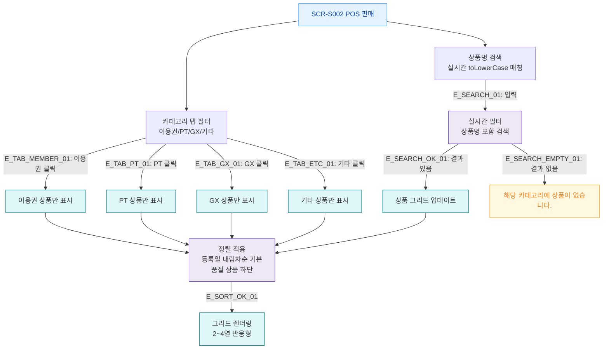

## 1. 목적
SCR-S002의 카테고리 탭 필터, 상품명 검색, 상품 정렬 흐름을 표현한다.

## 2. 전제조건
- SCR-S002 진입 완료, 상품 목록 로드됨

## 3. 다이어그램

## 4. 엣지 설명

| 엣지 ID | 출발 | 도착 | 설명 |
|---------|------|------|------|
| E_TAB_MEMBER_01 | TAB_FILTER | CAT_MEMBER | 이용권 탭 클릭 |
| E_SEARCH_01 | SEARCH_BOX | SEARCH_FILTER | 실시간 검색 |
| E_SEARCH_OK_01 | SEARCH_FILTER | GRID_UPDATE | 검색 결과 표시 |
| E_SEARCH_EMPTY_01 | SEARCH_FILTER | GRID_EMPTY | 결과 없음 |

## 5. TC 후보

| TC ID | 타입 | Given | When | Then |
|-------|------|-------|------|------|
| TC-S002-F4-01 | positive | POS 판매 | PT 탭 클릭 | PT 상품만 표시, 품절 하단 정렬 |
| TC-S002-F4-02 | positive | POS 판매 | 상품명 "PT" 검색 | 실시간 필터 적용 |
| TC-S002-F4-03 | negative | POS 판매 | 결과 없는 검색어 | 빈 상태 메시지 표시 |
