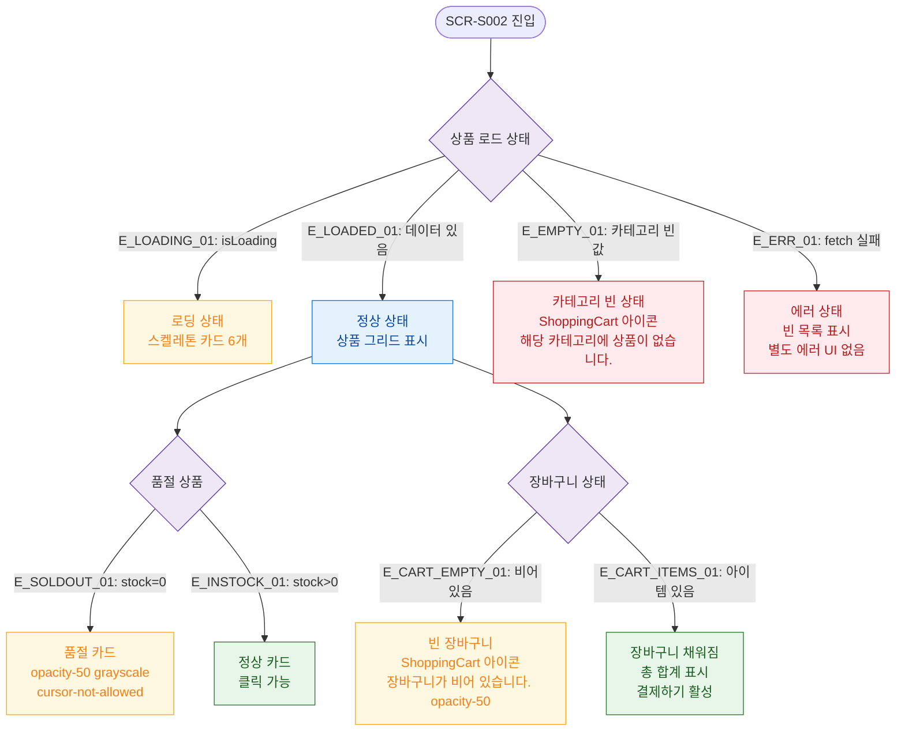

## 1. 목적
SCR-S002의 로딩/빈/에러/품절/장바구니 비어있음 등 모든 UI 상태를 표현한다.

## 2. 전제조건
- SCR-S002 진입 시도

## 3. 다이어그램

## 4. 엣지 설명

| 엣지 ID | 출발 | 도착 | 설명 |
|---------|------|------|------|
| E_LOADING_01 | PROD_LOAD | SKEL | 로딩 중 스켈레톤 6개 |
| E_LOADED_01 | PROD_LOAD | NORMAL | 정상 로드 |
| E_EMPTY_01 | PROD_LOAD | CAT_EMPTY | 카테고리 상품 없음 |
| E_ERR_01 | PROD_LOAD | ERR_STATE | fetch 실패 → 빈 목록 |
| E_SOLDOUT_01 | SOLDOUT_STATE | SOLDOUT_CARD | 품절 → 비활성 카드 |
| E_CART_EMPTY_01 | CART_STATE | EMPTY_CART | 장바구니 비어있음 |
| E_CART_ITEMS_01 | CART_STATE | CART_FILLED | 아이템 있음 → 결제 활성 |

## 5. TC 후보

| TC ID | 타입 | Given | When | Then |
|-------|------|-------|------|------|
| TC-S002-F6-01 | positive | POS 진입 | 상품 로드 중 | 스켈레톤 카드 6개 표시 |
| TC-S002-F6-02 | positive | GX 탭 | 상품 없음 | 빈 카테고리 메시지 |
| TC-S002-F6-03 | positive | 품절 상품 | 카드 확인 | opacity-50, 클릭 불가 |
| TC-S002-F6-04 | positive | 장바구니 비어있음 | 장바구니 영역 확인 | 빈 장바구니 안내 메시지 |
