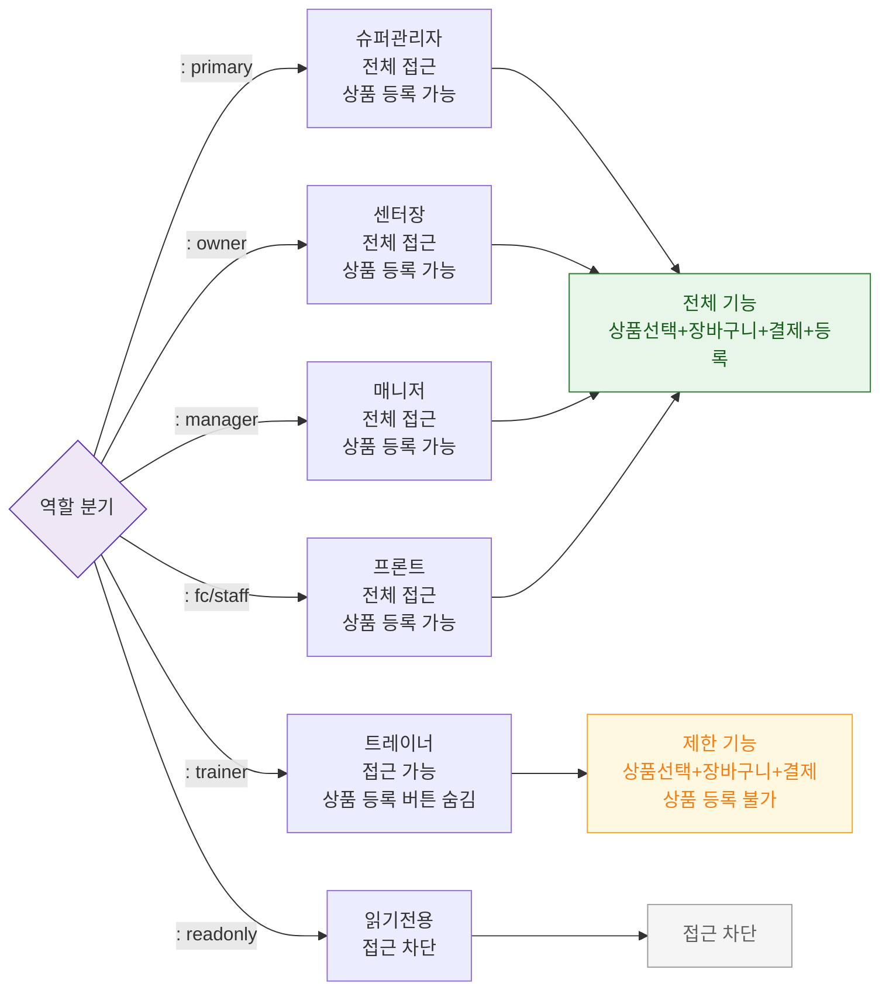

## 1. 목적
SCR-S002에서 6개 역할별 접근 범위와 제한을 표현한다.

## 2. 전제조건
- 로그인 완료

## 3. 다이어그램

## 4. 엣지 설명

| 출발 | 도착 | 설명 | |---------|------|------|------| | | AUTH | TR | 트레이너 — 상품 등록 버튼 숨김 | | | AUTH | RO | readonly — 접근 차단 |
