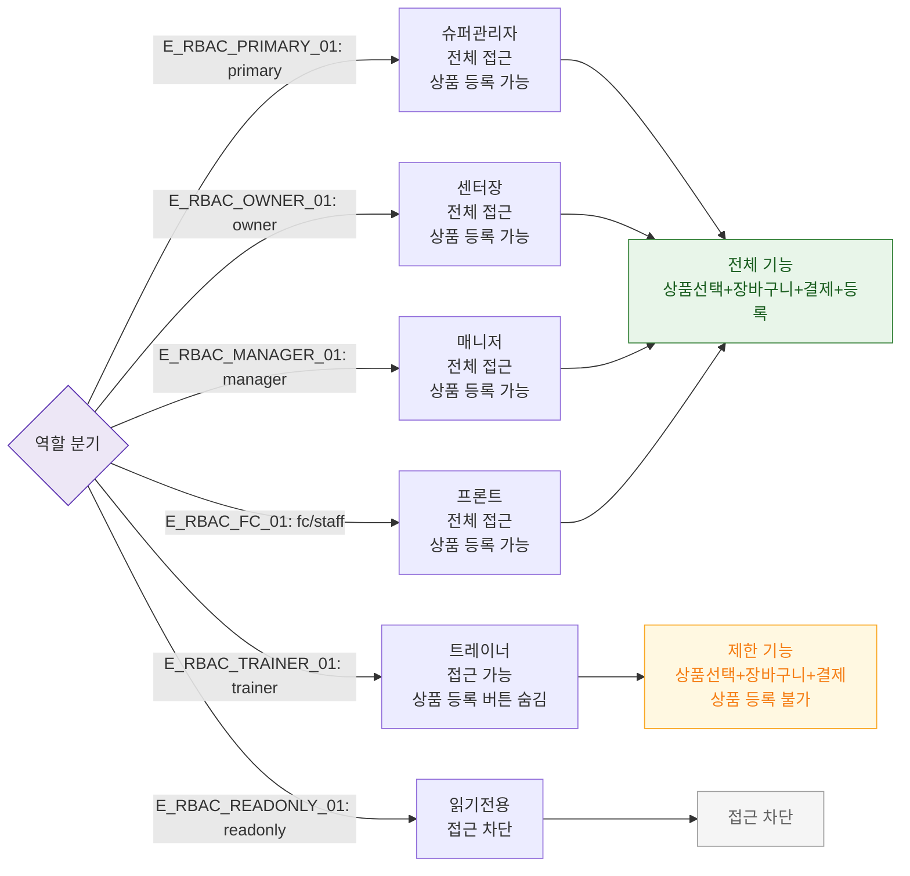

## 1. 목적
SCR-S002에서 6개 역할별 접근 범위와 제한을 표현한다.

## 2. 전제조건
- 로그인 완료

## 3. 다이어그램

## 4. 엣지 설명

| 엣지 ID | 출발 | 도착 | 설명 |
|---------|------|------|------|
| E_RBAC_TRAINER_01 | AUTH | TR | 트레이너 — 상품 등록 버튼 숨김 |
| E_RBAC_READONLY_01 | AUTH | RO | readonly — 접근 차단 |

## 5. TC 후보

| TC ID | 타입 | Given | When | Then |
|-------|------|-------|------|------|
| TC-S002-F7-01 | positive | fc 로그인 | POS 판매 진입 | 전체 기능 접근 |
| TC-S002-F7-02 | positive | trainer 로그인 | POS 판매 진입 | 상품 등록 버튼 없음 |
| TC-S002-F7-03 | negative | readonly 로그인 | /pos 접근 | 접근 차단 |
