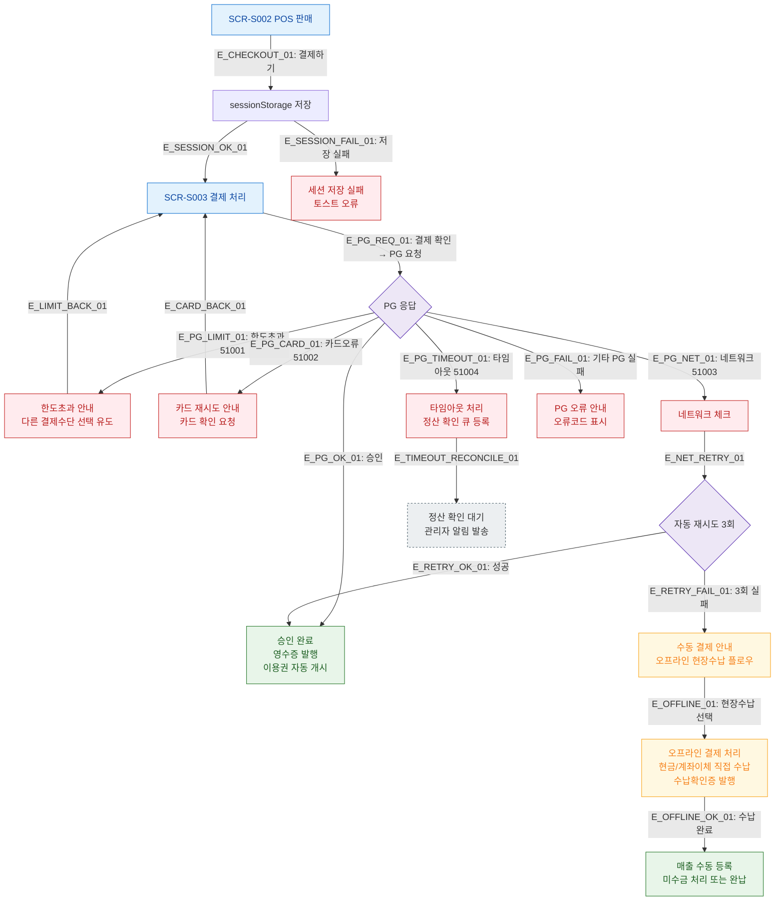

## 1. 목적
SCR-S002 POS 판매에서 발생 가능한 에러/예외 및 오프라인 결제(현장수납) 플로우를 포함한다. PG 실패, 한도초과, 카드오류, 네트워크, 타임아웃 분기를 별도로 표현한다.

## 2. 전제조건
- SCR-S002에서 결제하기 → SCR-S003 이동 후 PG 연동

## 3. 다이어그램

## 4. 엣지 설명

| 엣지 ID | 출발 | 도착 | 설명 |
|---------|------|------|------|
| E_PG_OK_01 | PG | PG_SUCCESS | PG 승인 → 영수증+이용권 자동 개시 |
| E_PG_LIMIT_01 | PG | ERR_LIMIT | 한도초과 51001 |
| E_PG_CARD_01 | PG | ERR_CARD | 카드오류 51002 |
| E_PG_NET_01 | PG | ERR_NET | 네트워크 오류 51003 |
| E_PG_TIMEOUT_01 | PG | ERR_TIMEOUT | 타임아웃 51004 → 정산 큐 |
| E_NET_RETRY_01 | ERR_NET | NET_RETRY | 자동 재시도 3회 |
| E_RETRY_FAIL_01 | NET_RETRY | MANUAL | 3회 실패 → 오프라인 안내 |
| E_OFFLINE_01 | MANUAL | OFFLINE_PAY | 현장수납 플로우 |

## 5. TC 후보

| TC ID | 타입 | Given | When | Then |
|-------|------|-------|------|------|
| TC-S002-F8-01 | exception | 결제 처리 | PG 한도초과 51001 | 한도초과 안내, SCR-S003 복귀 |
| TC-S002-F8-02 | exception | 결제 처리 | PG 카드오류 51002 | 카드 재시도 안내 |
| TC-S002-F8-03 | exception | 결제 처리 | 네트워크 오류 3회 재시도 실패 | 수동 결제 안내(오프라인) |
| TC-S002-F8-04 | exception | 결제 처리 | PG 타임아웃 51004 | 정산 확인 큐 등록 |
| TC-S002-F8-05 | positive | 오프라인 현장수납 | 현금 수납 완료 | 매출 수동 등록 |
| TC-S002-F8-06 | exception | sessionStorage | 저장 실패 | 오류 토스트 표시 |
