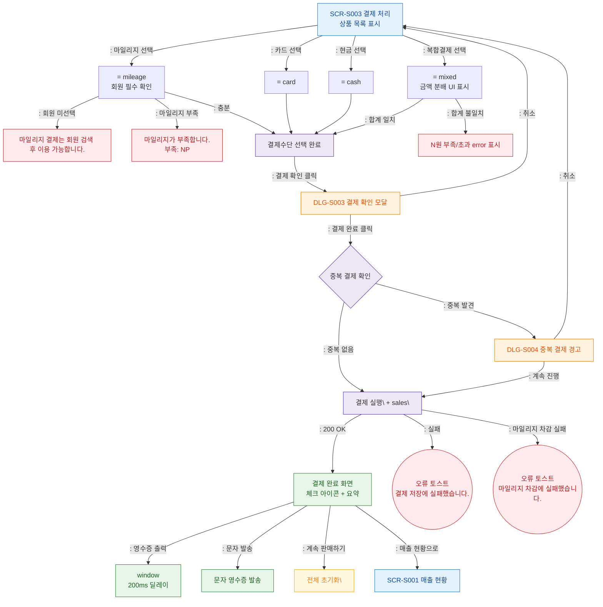

## 1. 목적
결제 처리의 Happy Path — 결제수단 선택 → 결제 확인 모달 → 결제 실행 → 완료 화면. 성공/검증실패/시스템에러 3갈래 분기 포함.

## 2. 전제조건
- SCR-S003 진입 완료, 장바구니 데이터 복원됨

## 3. 다이어그램

## 4. 엣지 설명

| 출발 | 도착 | 설명 | |---------|------|------|------| | | METHOD_MILEAGE | ERR_NO_MEMBER | 회원 미선택 시 마일리지 불가 | | | METHOD_MILEAGE | ERR_MILEAGE | 마일리지 잔액 부족 | | | METHOD_MIXED | ERR_MIXED | 복합결제 합계 불일치 | | | DUP_CHECK | DLG_S004 | 중복 결제 경고 모달 | | | EXEC_PAY | COMPLETE | 결제 성공 → 완료 화면 | | | EXEC_PAY | TOAST_ERR | 결제 실패 |
