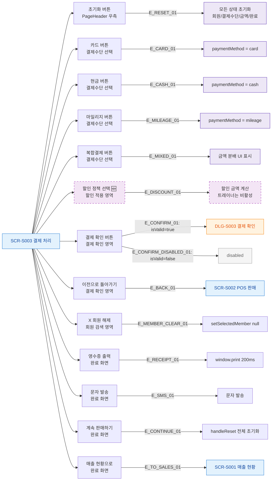

## 1. 목적
SCR-S003의 모든 버튼과 클릭 가능한 요소를 노드화한다.

## 2. 전제조건
- SCR-S003 진입 완료

## 3. 다이어그램

## 4. 엣지 설명

| 엣지 ID | 출발 | 도착 | 설명 |
|---------|------|------|------|
| E_CONFIRM_01 | BTN_CONFIRM | DLG_S003 | 유효성 통과 → 결제 확인 모달 |
| E_CONFIRM_DISABLED_01 | BTN_CONFIRM | DISABLED | 유효성 실패 → disabled |
| E_BACK_01 | BTN_BACK | SCR_S002 | 이전 POS 화면으로 |
| E_TO_SALES_01 | BTN_TO_SALES | SCR_S001 | 매출 현황으로 |

## 5. TC 후보

| TC ID | 타입 | Given | When | Then |
|-------|------|-------|------|------|
| TC-S003-F3-01 | positive | 카드 선택, isValid=true | 결제 확인 클릭 | DLG-S003 표시 |
| TC-S003-F3-02 | negative | 장바구니 비어있음 | 결제 확인 버튼 확인 | disabled 상태 |
| TC-S003-F3-03 | positive | 결제 완료 화면 | 매출 현황으로 클릭 | SCR-S001 이동 |
