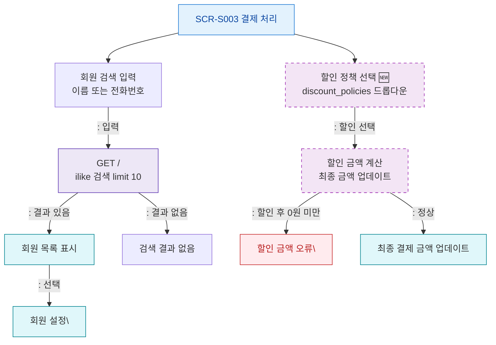

## 1. 목적
SCR-S003의 회원 검색 및 할인 정책 선택 흐름을 표현한다.

## 2. 전제조건
- SCR-S003 진입 완료

## 3. 다이어그램

## 4. 엣지 설명

| 출발 | 도착 | 설명 | |---------|------|------|------| | | MEMBER_SEARCH | SEARCH_API | 회원 검색 API 호출 | | | MEMBER_LIST | MEMBER_SET | 회원 선택 | | | DISCOUNT_CALC | ERR_DISCOUNT | 할인 후 0 미만 오류 |
