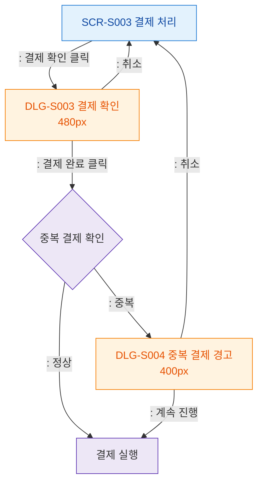

## 1. 목적
SCR-S003에서 발생하는 모달 트리거 트리를 표현한다.

## 2. 전제조건
- SCR-S003 진입 완료

## 3. 다이어그램

## 4. 엣지 설명

| 출발 | 도착 | 설명 | |---------|------|------|------| | | S003 | DLG_S003 | 결제 확인 버튼 | | | DUP_CHECK | DLG_S004 | 중복 결제 감지 → 경고 모달 | | | DLG_S004 | EXEC | 중복 무시하고 진행 |
