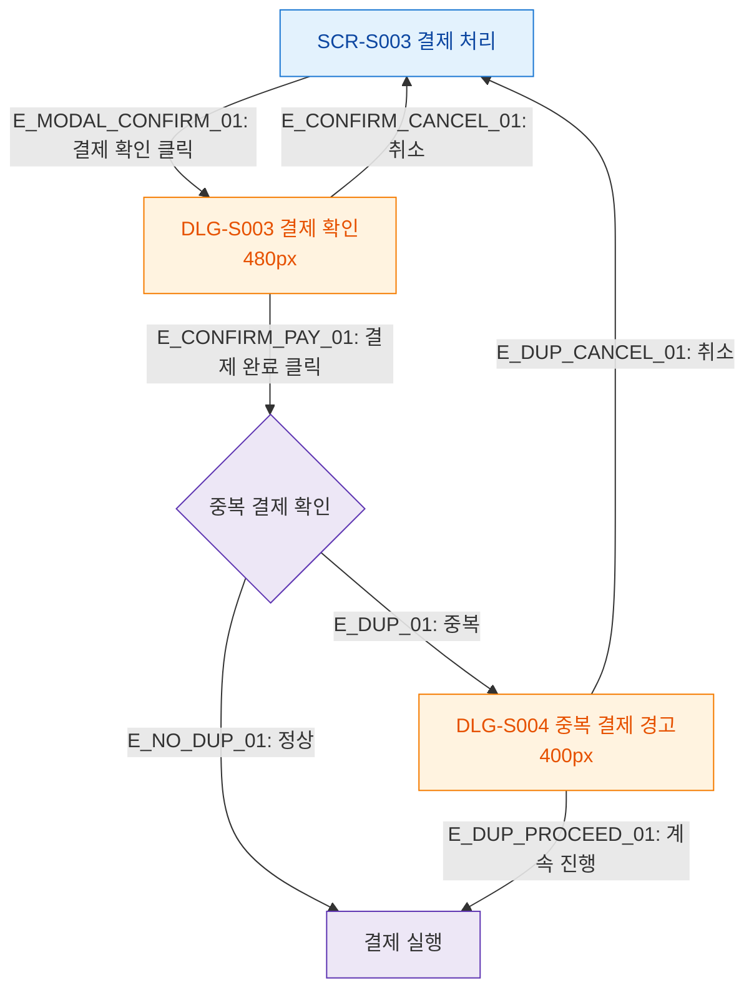

## 1. 목적
SCR-S003에서 발생하는 모달 트리거 트리를 표현한다.

## 2. 전제조건
- SCR-S003 진입 완료

## 3. 다이어그램

## 4. 엣지 설명

| 엣지 ID | 출발 | 도착 | 설명 |
|---------|------|------|------|
| E_MODAL_CONFIRM_01 | S003 | DLG_S003 | 결제 확인 버튼 |
| E_DUP_01 | DUP_CHECK | DLG_S004 | 중복 결제 감지 → 경고 모달 |
| E_DUP_PROCEED_01 | DLG_S004 | EXEC | 중복 무시하고 진행 |

## 5. TC 후보

| TC ID | 타입 | Given | When | Then |
|-------|------|-------|------|------|
| TC-S003-F5-01 | positive | isValid=true | 결제 확인 클릭 | DLG-S003 표시 |
| TC-S003-F5-02 | negative | 중복 결제 감지 | 결제 완료 클릭 | DLG-S004 경고 표시 |
| TC-S003-F5-03 | positive | DLG-S004 | 취소 클릭 | SCR-S003 복귀 |
