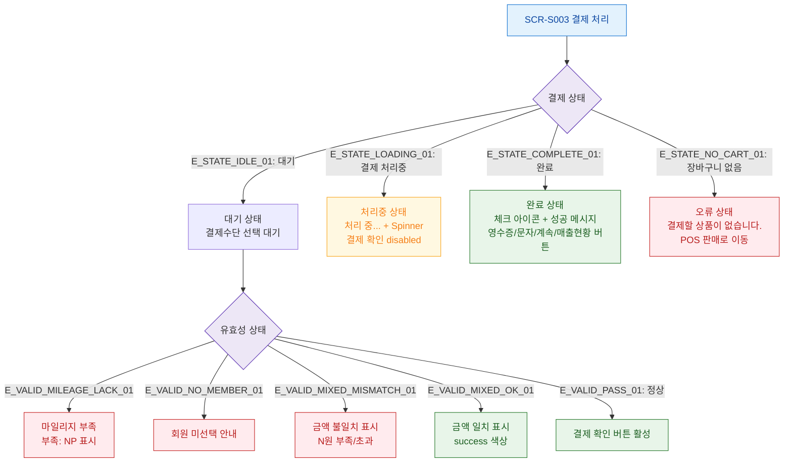

## 1. 목적
SCR-S003의 모든 UI 상태(로딩/완료/에러/마일리지부족 등)를 표현한다.

## 2. 전제조건
- SCR-S003 진입 완료

## 3. 다이어그램

## 4. 엣지 설명

| 엣지 ID | 출발 | 도착 | 설명 |
|---------|------|------|------|
| E_STATE_LOADING_01 | PAY_STATE | PROCESSING | 결제 처리 중 |
| E_STATE_COMPLETE_01 | PAY_STATE | COMPLETE | 결제 완료 |
| E_STATE_NO_CART_01 | PAY_STATE | NO_CART | 장바구니 없음 |
| E_VALID_MILEAGE_LACK_01 | VALID_STATE | ERR_MILEAGE | 마일리지 부족 |
| E_VALID_MIXED_MISMATCH_01 | VALID_STATE | ERR_MIXED | 복합결제 불일치 |

## 5. TC 후보

| TC ID | 타입 | Given | When | Then |
|-------|------|-------|------|------|
| TC-S003-F6-01 | positive | 결제 실행 중 | 결제 처리 상태 확인 | Spinner, 버튼 disabled |
| TC-S003-F6-02 | positive | 결제 성공 | 완료 화면 확인 | 체크 아이콘, 4개 버튼 표시 |
| TC-S003-F6-03 | negative | 마일리지 선택, 잔액 부족 | 금액 입력 | 부족 금액 표시, disabled |
| TC-S003-F6-04 | negative | 복합결제 불일치 | 금액 분배 | N원 부족/초과 표시 |
