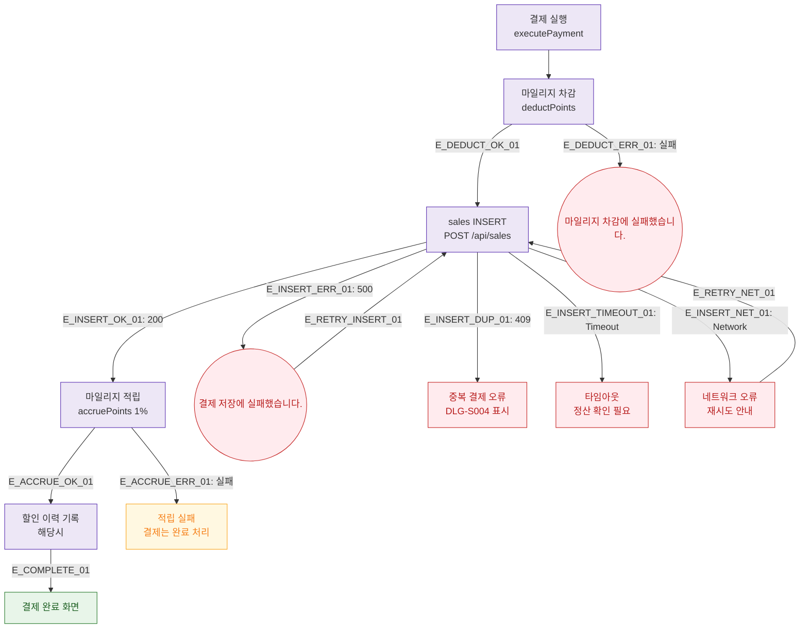

## 1. 목적
SCR-S003의 결제 실행 시 PG 오류, 마일리지 오류, 네트워크 오류 분기를 표현한다.

## 2. 전제조건
- DLG-S003에서 결제 완료 클릭

## 3. 다이어그램

## 4. 엣지 설명

| 엣지 ID | 출발 | 도착 | 설명 |
|---------|------|------|------|
| E_DEDUCT_ERR_01 | STEP1 | ERR_DEDUCT | 마일리지 차감 실패 |
| E_INSERT_ERR_01 | STEP2 | ERR_INSERT | sales INSERT 500 오류 |
| E_INSERT_DUP_01 | STEP2 | ERR_DUP | 409 중복 결제 |
| E_INSERT_TIMEOUT_01 | STEP2 | ERR_TIMEOUT | 타임아웃 |
| E_ACCRUE_ERR_01 | STEP3 | ERR_ACCRUE | 적립 실패(결제는 완료) |

## 5. TC 후보

| TC ID | 타입 | Given | When | Then |
|-------|------|-------|------|------|
| TC-S003-F8-01 | exception | 마일리지 결제 | 차감 API 실패 | 마일리지 차감 실패 토스트 |
| TC-S003-F8-02 | exception | 결제 실행 | sales INSERT 500 | 결제 저장 실패 토스트 |
| TC-S003-F8-03 | exception | 결제 실행 | 타임아웃 | 정산 확인 필요 안내 |
| TC-S003-F8-04 | exception | 결제 실행 | 409 중복 | DLG-S004 경고 표시 |
| TC-S003-F8-05 | exception | 마일리지 적립 | 적립 실패 | 결제는 완료, 적립 실패 안내 |
