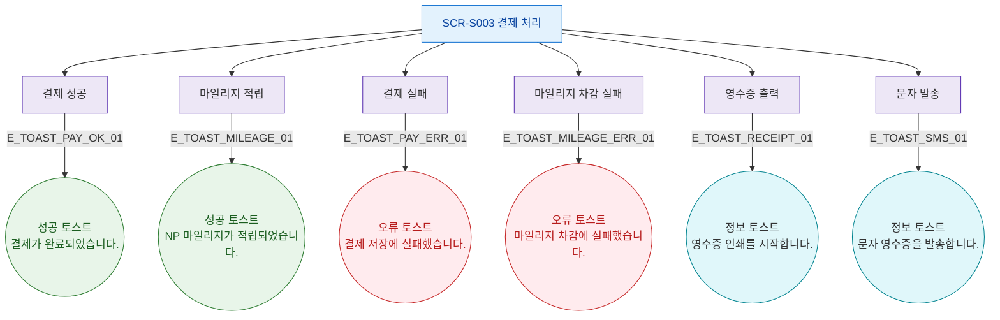

## 1. 목적
SCR-S003에서 발생하는 모든 토스트/피드백 메시지 발생 조건을 표현한다.

## 2. 전제조건
- SCR-S003 진입 완료

## 3. 다이어그램

## 4. 엣지 설명

| 엣지 ID | 토스트 타입 | 메시지 |
|---------|-------------|--------|
| E_TOAST_PAY_OK_01 | success | 결제가 완료되었습니다. |
| E_TOAST_MILEAGE_01 | success | NP 마일리지가 적립되었습니다. |
| E_TOAST_PAY_ERR_01 | error | 결제 저장에 실패했습니다. |
| E_TOAST_MILEAGE_ERR_01 | error | 마일리지 차감에 실패했습니다. |
| E_TOAST_RECEIPT_01 | info | 영수증 인쇄를 시작합니다. |
| E_TOAST_SMS_01 | info | 문자 영수증을 발송합니다. |

## 5. TC 후보

| TC ID | 타입 | Given | When | Then |
|-------|------|-------|------|------|
| TC-S003-F9-01 | positive | 결제 성공 | 완료 | success 토스트 |
| TC-S003-F9-02 | positive | 마일리지 적립 | 완료 | success 토스트 NP 표시 |
| TC-S003-F9-03 | exception | 결제 실행 | API 오류 | error 토스트 |
| TC-S003-F9-04 | exception | 마일리지 차감 | 실패 | error 토스트 |
| TC-S003-F9-05 | positive | 완료 화면 | 영수증 출력 | info 토스트 |
| TC-S003-F9-06 | positive | 완료 화면 | 문자 발송 | info 토스트 |
