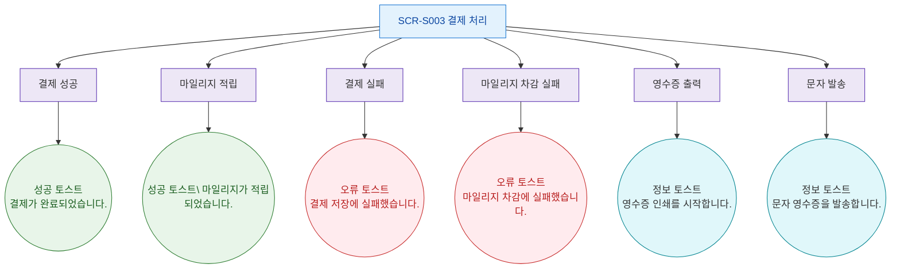

## 1. 목적
SCR-S003에서 발생하는 모든 토스트/피드백 메시지 발생 조건을 표현한다.

## 2. 전제조건
- SCR-S003 진입 완료

## 3. 다이어그램

## 4. 엣지 설명

| 토스트 타입 | 메시지 | |---------|-------------|--------| | | success | 결제가 완료되었습니다. | | | success | NP 마일리지가 적립되었습니다. | | | error | 결제 저장에 실패했습니다. | | | error | 마일리지 차감에 실패했습니다. | | | info | 영수증 인쇄를 시작합니다. | | | info | 문자 영수증을 발송합니다. |
