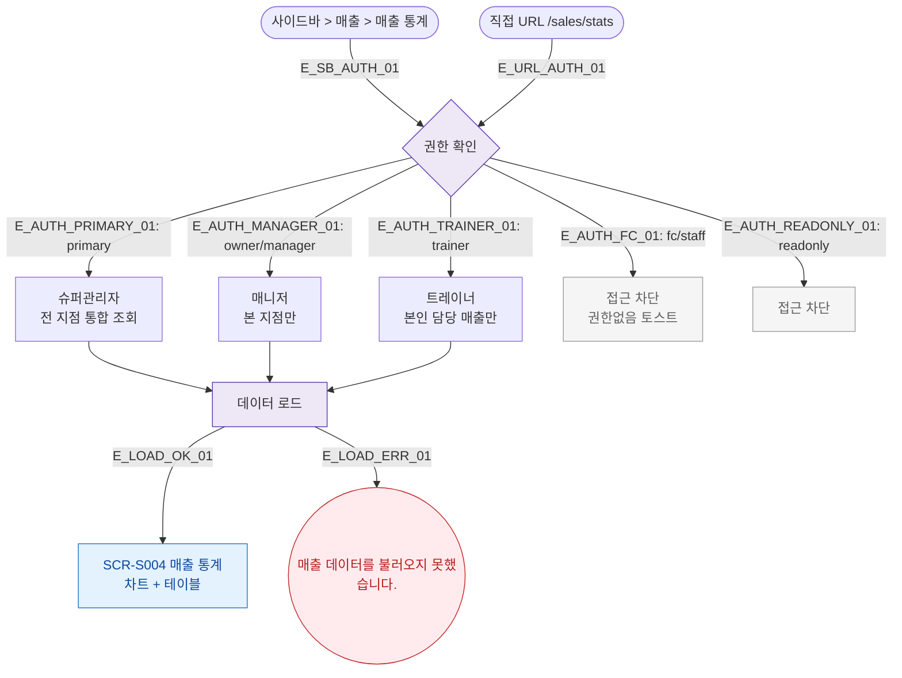

## 1. 목적
SCR-S004 매출 통계 화면의 진입 경로와 권한 분기를 표현한다.

## 2. 전제조건
- 로그인 완료

## 3. 다이어그램

## 4. 엣지 설명

| 엣지 ID | 출발 | 도착 | 설명 |
|---------|------|------|------|
| E_AUTH_FC_01 | AUTH | FC_BLOCK | 프론트 접근 차단 |
| E_LOAD_ERR_01 | LOAD | ERR | API 오류 |

## 5. TC 후보

| TC ID | 타입 | Given | When | Then |
|-------|------|-------|------|------|
| TC-S004-F1-01 | positive | 매니저 로그인 | 매출 통계 진입 | 차트+테이블 정상 표시 |
| TC-S004-F1-02 | negative | fc 로그인 | /sales/stats 접근 | 접근 차단 |
| TC-S004-F1-03 | positive | primary 로그인 | 매출 통계 진입 | 전 지점 통합 조회 |
