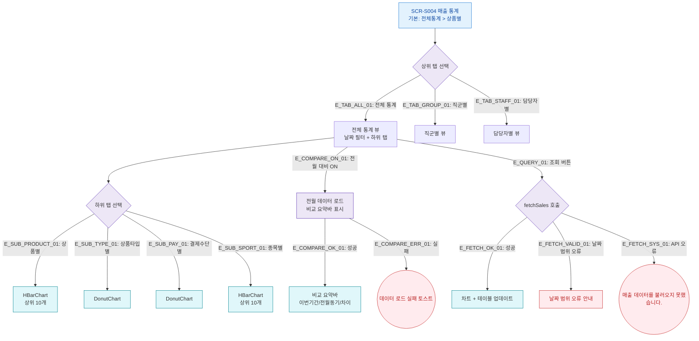

## 1. 목적
매출 통계의 탭 전환, 전월 대비 토글, 차트 표시 Happy Path를 표현한다. 성공/검증실패/시스템에러 3갈래 분기 포함.

## 2. 전제조건
- SCR-S004 진입 완료

## 3. 다이어그램

## 4. 엣지 설명

| 엣지 ID | 출발 | 도착 | 설명 |
|---------|------|------|------|
| E_COMPARE_ON_01 | ALL_TAB | COMPARE | 전월 대비 토글 ON |
| E_FETCH_OK_01 | FETCH | CHART_UPDATE | 조회 성공 |
| E_FETCH_SYS_01 | FETCH | ERR_API | API 오류 |

## 5. TC 후보

| TC ID | 타입 | Given | When | Then |
|-------|------|-------|------|------|
| TC-S004-F2-01 | positive | 전체 통계 | 상품별 탭 | HBarChart 상위 10개 표시 |
| TC-S004-F2-02 | positive | 전체 통계 | 전월 대비 ON | 비교 요약바 표시 |
| TC-S004-F2-03 | positive | 전체 통계 | 조회 버튼 | 차트/테이블 갱신 |
| TC-S004-F2-04 | exception | 전체 통계 | API 오류 | 에러 토스트 |
