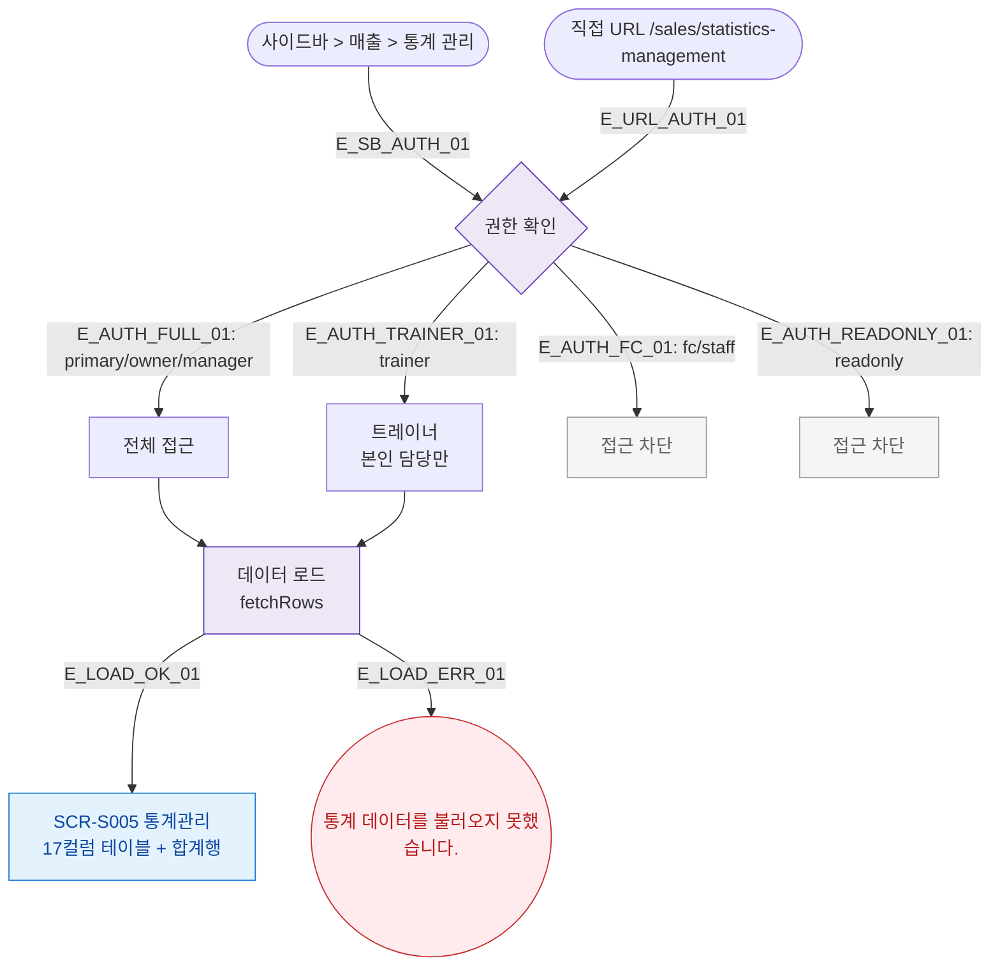

## 1. 목적
SCR-S005 통계관리(레슨북 스타일) 화면의 진입 경로와 권한 분기를 표현한다.

## 2. 전제조건
- 로그인 완료

## 3. 다이어그램

## 4. 엣지 설명

| 엣지 ID | 출발 | 도착 | 설명 |
|---------|------|------|------|
| E_AUTH_FC_01 | AUTH | FC_BLOCK | 프론트 접근 차단 |
| E_LOAD_ERR_01 | LOAD | ERR | 통계 데이터 로드 실패 |

## 5. TC 후보

| TC ID | 타입 | Given | When | Then |
|-------|------|-------|------|------|
| TC-S005-F1-01 | positive | 매니저 로그인 | 통계관리 진입 | 17컬럼 테이블 표시 |
| TC-S005-F1-02 | negative | fc 로그인 | /sales/statistics-management 접근 | 접근 차단 |
| TC-S005-F1-03 | positive | trainer 로그인 | 통계관리 진입 | 본인 담당 데이터만 표시 |
