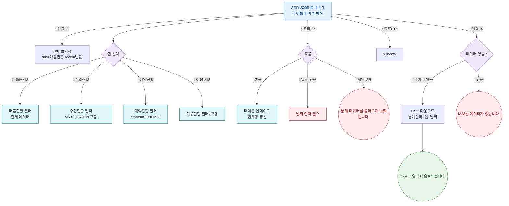

## 1. 목적
통계관리 레슨북 스타일 화면의 탭 전환, 조회, CSV 내보내기 Happy Path. 성공/검증실패/시스템에러 3갈래 분기 포함.

## 2. 전제조건
- SCR-S005 진입 완료, 기본 탭: 매출현황

## 3. 다이어그램

## 4. 엣지 설명

| 출발 | 도착 | 설명 | |---------|------|------|------| | | S005 | FETCH | 조회(F2) 버튼 클릭 | | | S005 | CSV_CHECK | 엑셀(F9) 클릭 | | | FETCH | ERR_API | API 오류 | | | CSV_CHECK | ERR_CSV | 데이터 없음 |
