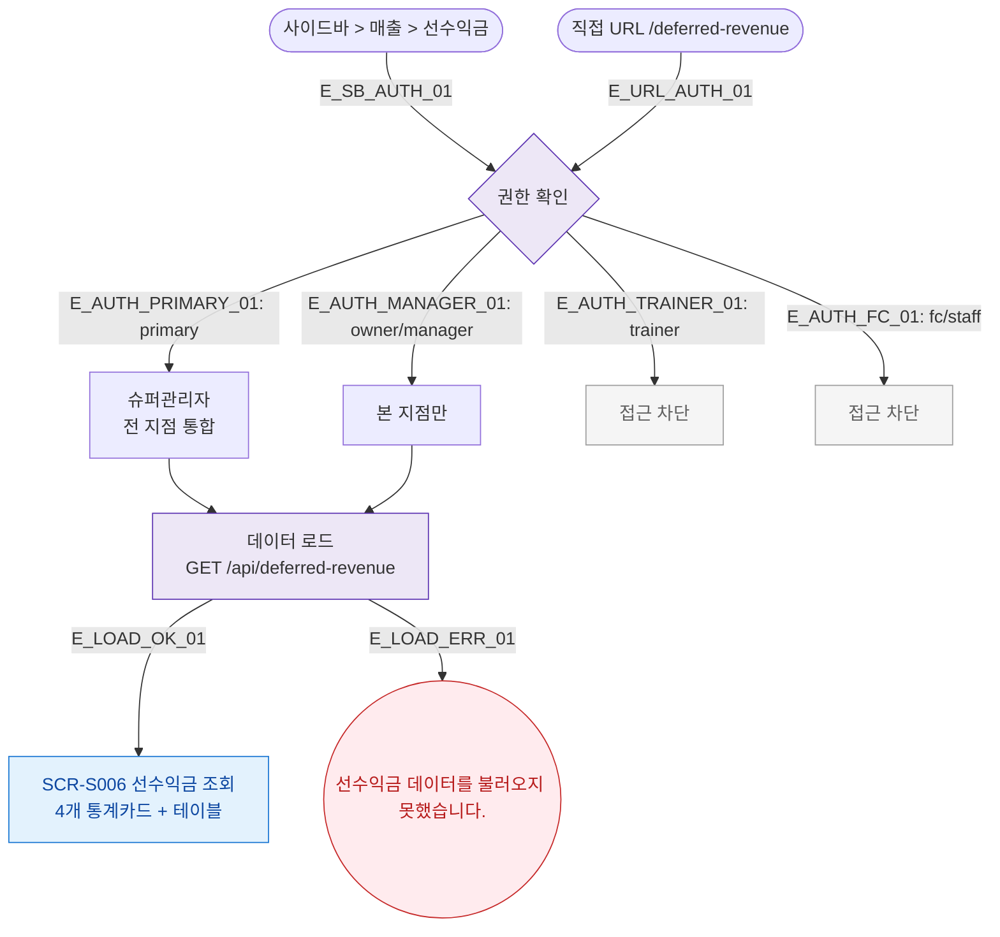

## 1. 목적
SCR-S006 선수익금 조회 화면의 진입 경로와 권한 분기를 표현한다.

## 2. 전제조건
- 로그인 완료

## 3. 다이어그램

## 4. 엣지 설명

| 엣지 ID | 출발 | 도착 | 설명 |
|---------|------|------|------|
| E_AUTH_TRAINER_01 | AUTH | TR_BLOCK | 트레이너 접근 차단 |
| E_AUTH_FC_01 | AUTH | FC_BLOCK | 프론트 접근 차단 |

## 5. TC 후보

| TC ID | 타입 | Given | When | Then |
|-------|------|-------|------|------|
| TC-S006-F1-01 | positive | 매니저 로그인 | 선수익금 진입 | 통계카드 4개 + 테이블 표시 |
| TC-S006-F1-02 | negative | trainer 로그인 | /deferred-revenue 접근 | 접근 차단 |
| TC-S006-F1-03 | positive | primary 로그인 | 선수익금 진입 | 전 지점 통합 조회 |
