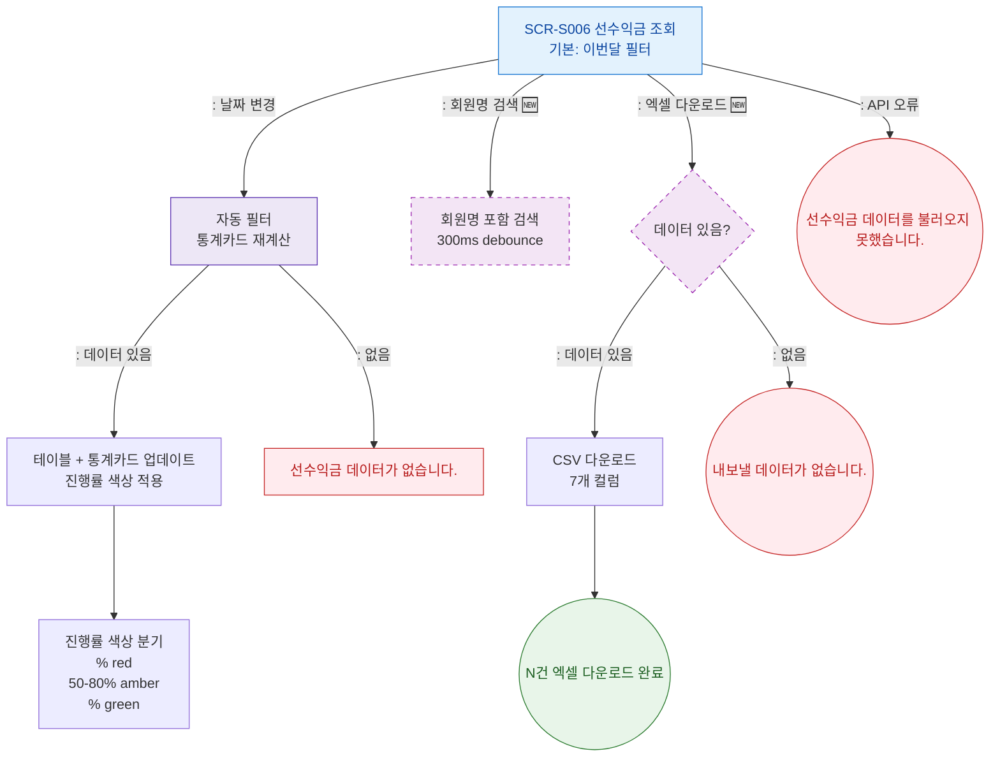

## 1. 목적
선수익금 조회의 필터 적용, 진행률 표시, 엑셀 내보내기 Happy Path. 성공/검증실패/시스템에러 3갈래 분기 포함.

## 2. 전제조건
- SCR-S006 진입 완료

## 3. 다이어그램

## 4. 엣지 설명

| 출발 | 도착 | 설명 | |---------|------|------|------| | | S006 | FILTER_APPLY | 날짜 변경 → 자동 필터 | | | S006 | SEARCH_FILTER | 회원명 검색 (🆕) | | | S006 | EXCEL_CHECK | 엑셀 다운로드 (🆕) | | | FILTER_APPLY | EMPTY | 필터 결과 없음 |
