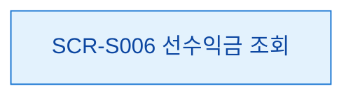

## 1. 목적
SCR-S006 선수익금 조회 — F3_버튼액션 플로우.

## 2. 전제조건
- SCR-S006 진입 완료

## 3. 다이어그램

```mermaid
flowchart TD
    SCR[SCR-S006 선수익금 조회]

    classDef screen fill:#E3F2FD,stroke:#1976D2,color:#0D47A1
    classDef newFeature fill:#F3E5F5,stroke:#9C27B0,stroke-dasharray:5 5
    class SCR screen
```

## 4. 엣지 설명
화면설계서 SCR-S006 기준으로 작성 예정.

## 5. TC 후보
화면설계서 SCR-S006 기준으로 TC 도출 예정.
