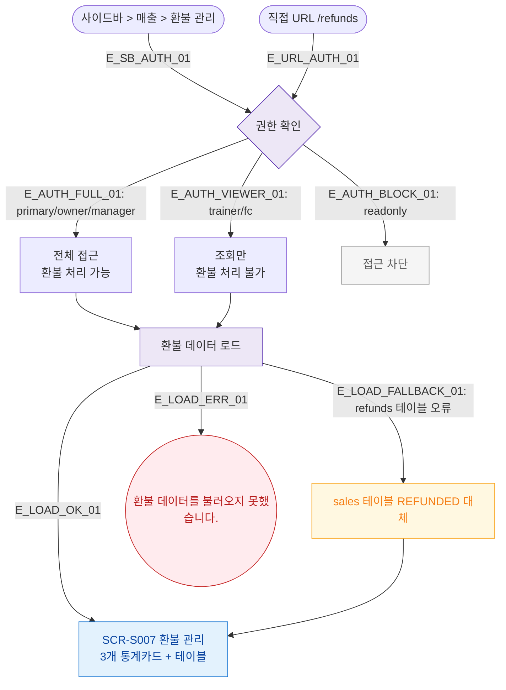

## 1. 목적
SCR-S007 환불 관리 진입 경로와 권한 분기를 표현한다.

## 2. 전제조건
- 로그인 완료

## 3. 다이어그램

## 4. 엣지 설명

| 엣지 ID | 출발 | 도착 | 설명 |
|---------|------|------|------|
| E_AUTH_VIEWER_01 | AUTH | VIEWER | 트레이너/프론트 — 조회만 |
| E_LOAD_FALLBACK_01 | LOAD | FALLBACK | refunds 테이블 오류 시 fallback |

## 5. TC 후보

| TC ID | 타입 | Given | When | Then |
|-------|------|-------|------|------|
| TC-S007-F1-01 | positive | 매니저 로그인 | 환불 관리 진입 | 환불 내역 테이블 표시 |
| TC-S007-F1-02 | positive | trainer 로그인 | 환불 관리 진입 | 조회만, 처리 버튼 없음 |
| TC-S007-F1-03 | exception | refunds 테이블 오류 | 환불 관리 진입 | sales fallback 데이터 표시 |
