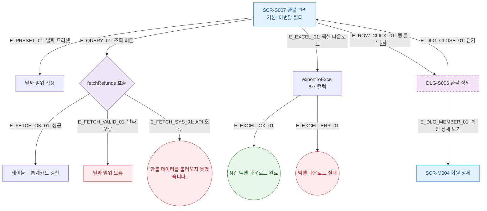

## 1. 목적
환불 관리의 필터/조회, 행 클릭 → 환불 상세 모달, 엑셀 내보내기 Happy Path. 성공/검증실패/시스템에러 3갈래 분기 포함.

## 2. 전제조건
- SCR-S007 진입 완료

## 3. 다이어그램

## 4. 엣지 설명

| 엣지 ID | 출발 | 도착 | 설명 |
|---------|------|------|------|
| E_ROW_CLICK_01 | S007 | DLG_S006 | 행 클릭 → 환불 상세 모달 (🆕) |
| E_FETCH_SYS_01 | FETCH | ERR_API | API 오류 |
| E_DLG_MEMBER_01 | DLG_S006 | SCR_M004 | 회원 상세 이동 |

## 5. TC 후보

| TC ID | 타입 | Given | When | Then |
|-------|------|-------|------|------|
| TC-S007-F2-01 | positive | 환불 관리 | 조회 버튼 | 테이블 갱신 |
| TC-S007-F2-02 | positive | 환불 관리 | 행 클릭 | DLG-S006 환불 상세 표시 |
| TC-S007-F2-03 | positive | 환불 관리 | 엑셀 다운로드 | N건 성공 토스트 |
| TC-S007-F2-04 | exception | 환불 관리 | API 오류 | 에러 토스트 |
