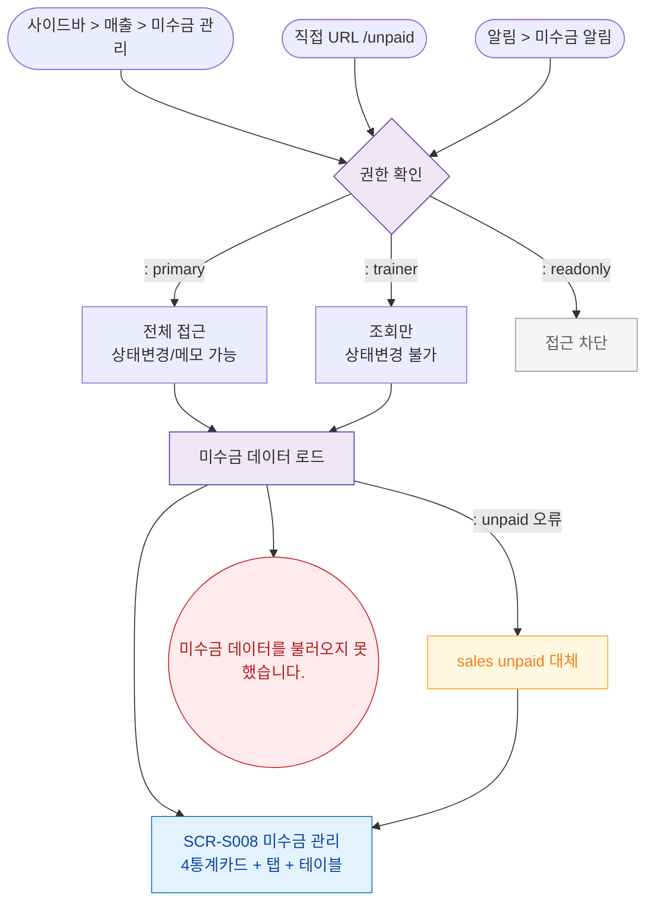

## 1. 목적
SCR-S008 미수금 관리 진입 경로와 권한 분기를 표현한다.

## 2. 전제조건
- 로그인 완료

## 3. 다이어그램

## 4. 엣지 설명

| 출발 | 도착 | 설명 | |---------|------|------|------| | | AUTH | TRAINER | 트레이너 조회만 | | | LOAD | FALLBACK | unpaid 테이블 오류 → sales fallback |
