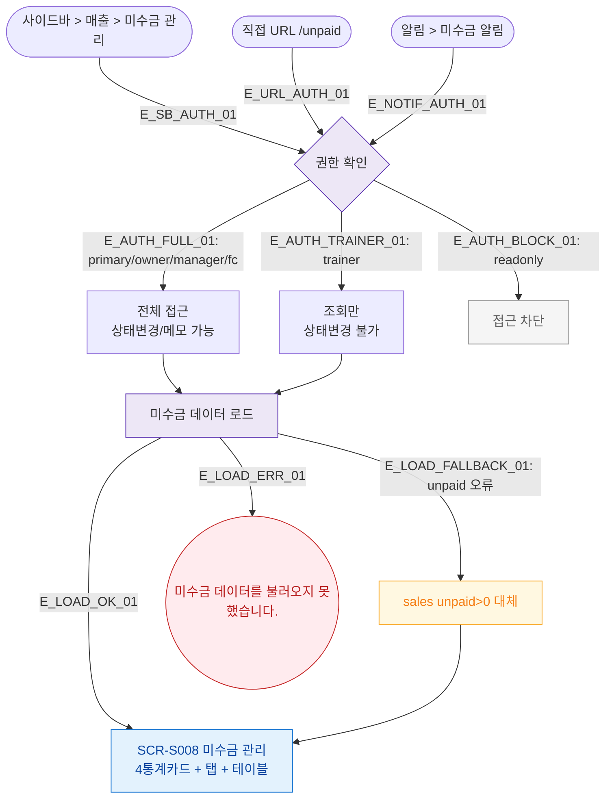

## 1. 목적
SCR-S008 미수금 관리 진입 경로와 권한 분기를 표현한다.

## 2. 전제조건
- 로그인 완료

## 3. 다이어그램

## 4. 엣지 설명

| 엣지 ID | 출발 | 도착 | 설명 |
|---------|------|------|------|
| E_AUTH_TRAINER_01 | AUTH | TRAINER | 트레이너 조회만 |
| E_LOAD_FALLBACK_01 | LOAD | FALLBACK | unpaid 테이블 오류 → sales fallback |

## 5. TC 후보

| TC ID | 타입 | Given | When | Then |
|-------|------|-------|------|------|
| TC-S008-F1-01 | positive | 매니저 로그인 | 미수금 관리 진입 | 4통계카드 + 테이블 표시 |
| TC-S008-F1-02 | positive | trainer 로그인 | 미수금 관리 진입 | 상태변경 Select 비활성 |
| TC-S008-F1-03 | exception | unpaid 테이블 오류 | 진입 | sales fallback 데이터 표시 |
