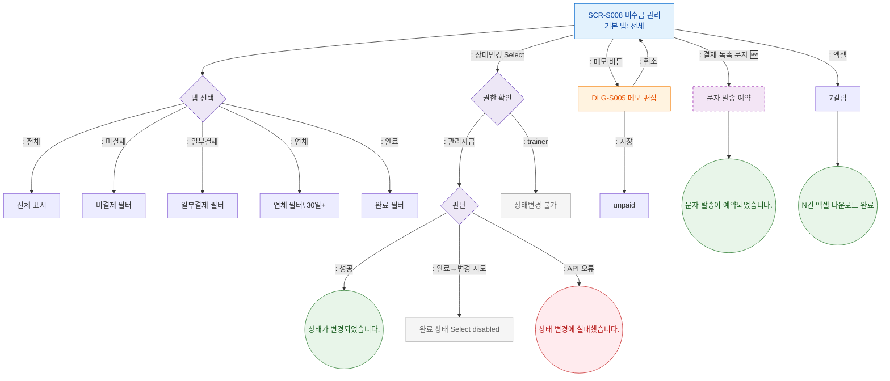

## 1. 목적
미수금 관리의 탭 전환, 상태 변경, 메모 편집, 독촉 문자 발송 Happy Path. 성공/검증실패/시스템에러 3갈래 분기 포함.

## 2. 전제조건
- SCR-S008 진입 완료

## 3. 다이어그램

## 4. 엣지 설명

| 출발 | 도착 | 설명 | |---------|------|------|------| | | S008 | STATUS_AUTH | 상태변경 Select 조작 | | | STATUS_AUTH | STATUS_BLOCKED | 트레이너 차단 | | | STATUS_UPDATE | TOAST_STATUS_OK | 상태 변경 성공 | | | STATUS_UPDATE | TOAST_STATUS_ERR | API 오류 | | | S008 | NOTICE_SEND | 독촉 문자 발송 (🆕) | | | S008 | DLG_S005 | 메모 편집 모달 |
