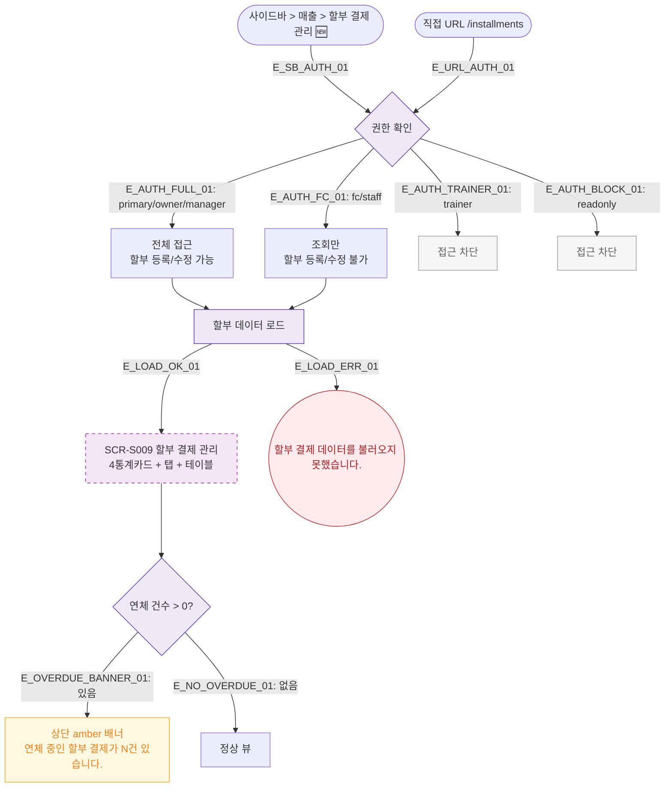

## 1. 목적
SCR-S009 할부 결제 관리(🆕 기획 초안) 진입 경로와 권한 분기를 표현한다.

## 2. 전제조건
- 로그인 완료

## 3. 다이어그램

## 4. 엣지 설명

| 엣지 ID | 출발 | 도착 | 설명 |
|---------|------|------|------|
| E_AUTH_FC_01 | AUTH | FC | 프론트 조회만 |
| E_AUTH_TRAINER_01 | AUTH | TR_BLOCK | 트레이너 접근 차단 |
| E_OVERDUE_BANNER_01 | OVERDUE_CHECK | OVERDUE_BANNER | 연체 건 amber 배너 |

## 5. TC 후보

| TC ID | 타입 | Given | When | Then |
|-------|------|-------|------|------|
| TC-S009-F1-01 | positive | 매니저 로그인 | 할부 결제 관리 진입 | 4통계카드 + 테이블 표시 |
| TC-S009-F1-02 | negative | trainer 로그인 | /installments 접근 | 접근 차단 |
| TC-S009-F1-03 | positive | 연체 건 있음 | 진입 | amber 배너 표시 |
