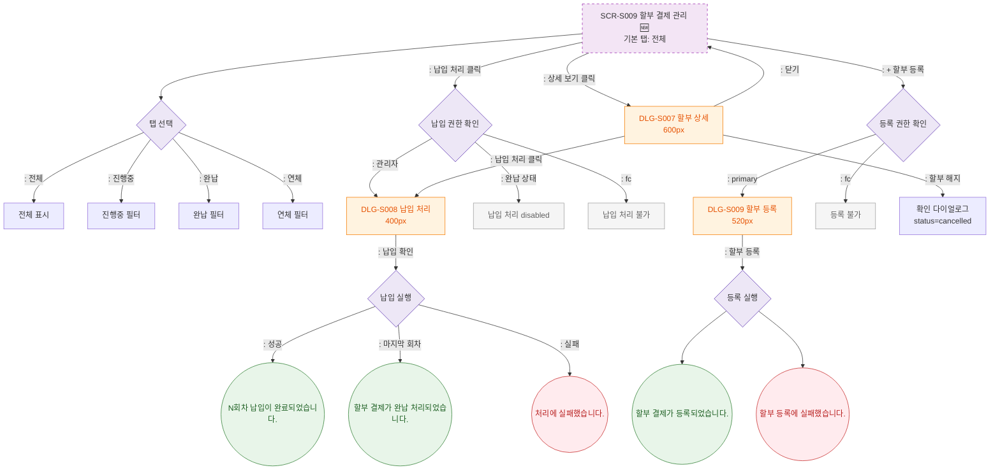

## 1. 목적
할부 결제 관리의 탭 전환, 상세 조회, 납입 처리, 할부 등록 Happy Path. 성공/검증실패/시스템에러 3갈래 분기 포함. 🆕 기획 초안.

## 2. 전제조건
- SCR-S009 진입 완료

## 3. 다이어그램

## 4. 엣지 설명

| 출발 | 도착 | 설명 | |---------|------|------|------| | | S009 | DLG_S007 | 상세 보기 → 할부 상세 모달 | | | S009 | PAY_AUTH | 납입 처리 클릭 | | | PAY_AUTH | PAY_DISABLED | 완납 상태 → disabled | | | PAY_EXEC | TOAST_FULL | 마지막 회차 납입 → 완납 처리 | | | REG_AUTH | DLG_S009 | 할부 등록 모달 |
