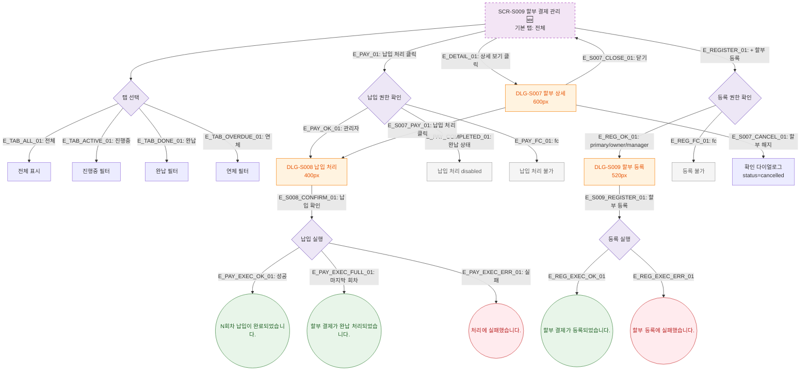

## 1. 목적
할부 결제 관리의 탭 전환, 상세 조회, 납입 처리, 할부 등록 Happy Path. 성공/검증실패/시스템에러 3갈래 분기 포함. 🆕 기획 초안.

## 2. 전제조건
- SCR-S009 진입 완료

## 3. 다이어그램

## 4. 엣지 설명

| 엣지 ID | 출발 | 도착 | 설명 |
|---------|------|------|------|
| E_DETAIL_01 | S009 | DLG_S007 | 상세 보기 → 할부 상세 모달 |
| E_PAY_01 | S009 | PAY_AUTH | 납입 처리 클릭 |
| E_PAY_COMPLETED_01 | PAY_AUTH | PAY_DISABLED | 완납 상태 → disabled |
| E_PAY_EXEC_FULL_01 | PAY_EXEC | TOAST_FULL | 마지막 회차 납입 → 완납 처리 |
| E_REG_OK_01 | REG_AUTH | DLG_S009 | 할부 등록 모달 |

## 5. TC 후보

| TC ID | 타입 | Given | When | Then |
|-------|------|-------|------|------|
| TC-S009-F2-01 | positive | 진행중 할부 | 납입 처리 클릭 | DLG-S008 표시 |
| TC-S009-F2-02 | positive | 납입 처리 모달 | 납입 확인 | N회차 납입 완료 토스트 |
| TC-S009-F2-03 | positive | 마지막 회차 납입 | 납입 확인 | 완납 처리 토스트 |
| TC-S009-F2-04 | negative | 완납 상태 | 납입 처리 버튼 | disabled 확인 |
| TC-S009-F2-05 | positive | 관리자 | + 할부 등록 | DLG-S009 표시 |
