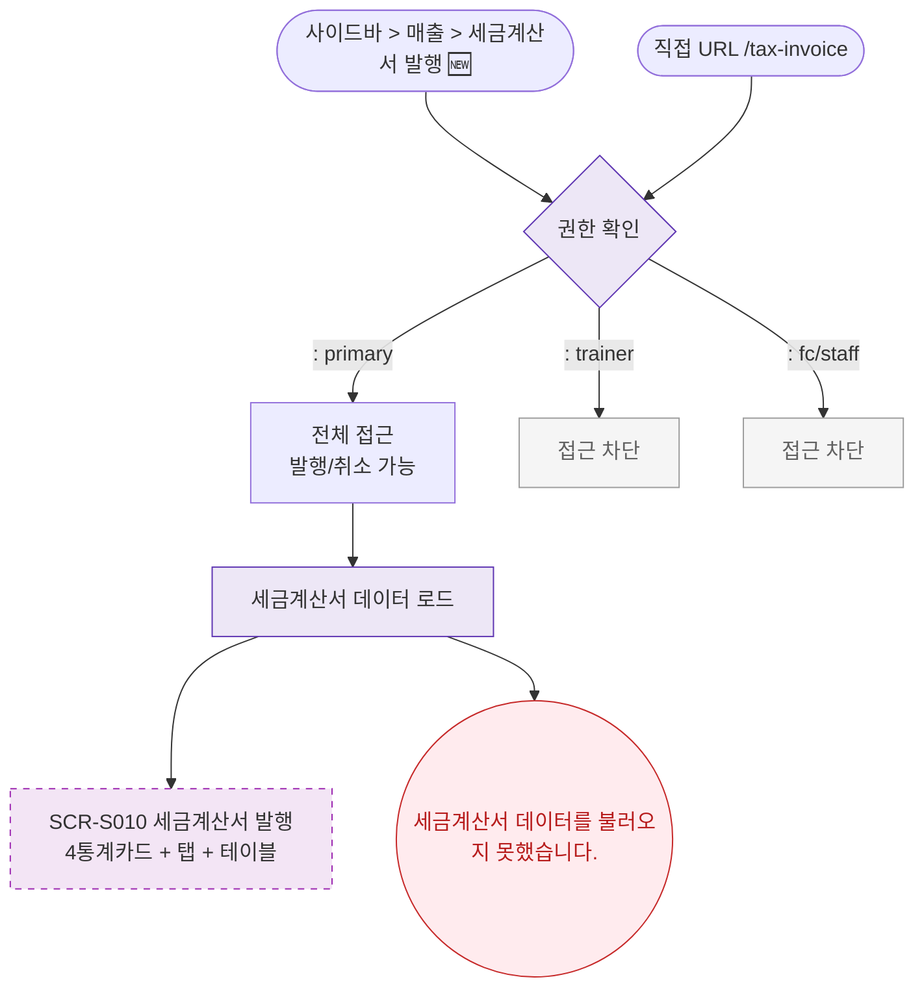

## 1. 목적
SCR-S010 세금계산서 발행(🆕 기획 초안) 진입 경로와 권한 분기를 표현한다.

## 2. 전제조건
- 로그인 완료

## 3. 다이어그램

## 4. 엣지 설명

| 출발 | 도착 | 설명 | |---------|------|------|------| | | AUTH | TR_BLOCK | 트레이너 접근 차단 | | | AUTH | FC_BLOCK | 프론트 접근 차단 |
