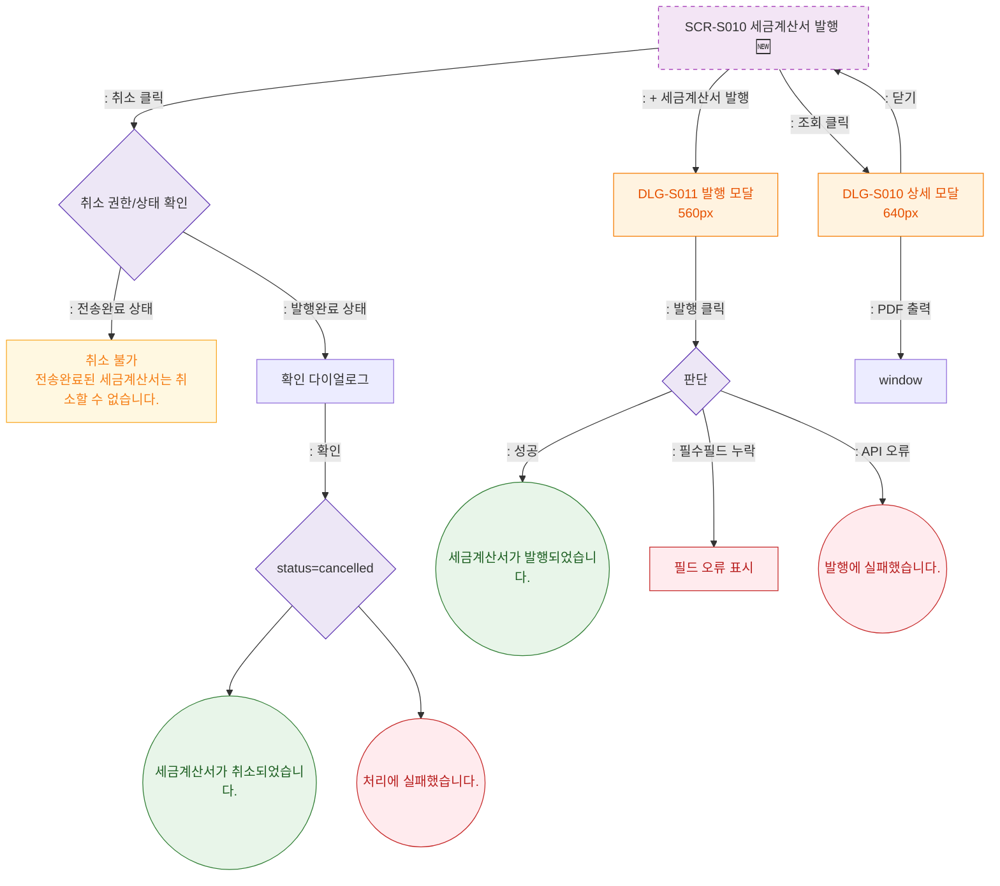

## 1. 목적
세금계산서 발행 화면의 발행/조회/취소 Happy Path. 성공/검증실패/시스템에러 3갈래 분기 포함. 🆕 기획 초안.

## 2. 전제조건
- SCR-S010 진입 완료

## 3. 다이어그램

## 4. 엣지 설명

| 출발 | 도착 | 설명 | |---------|------|------|------| | | CANCEL_AUTH | CANCEL_BLOCKED | 전송완료 → 취소 불가 warning | | | ISSUE_EXEC | TOAST_ISSUE_OK | 발행 성공 | | | ISSUE_EXEC | ERR_VALID | 필수필드 누락 | | | DLG_S010 | PDF_PRINT | PDF 출력 |
