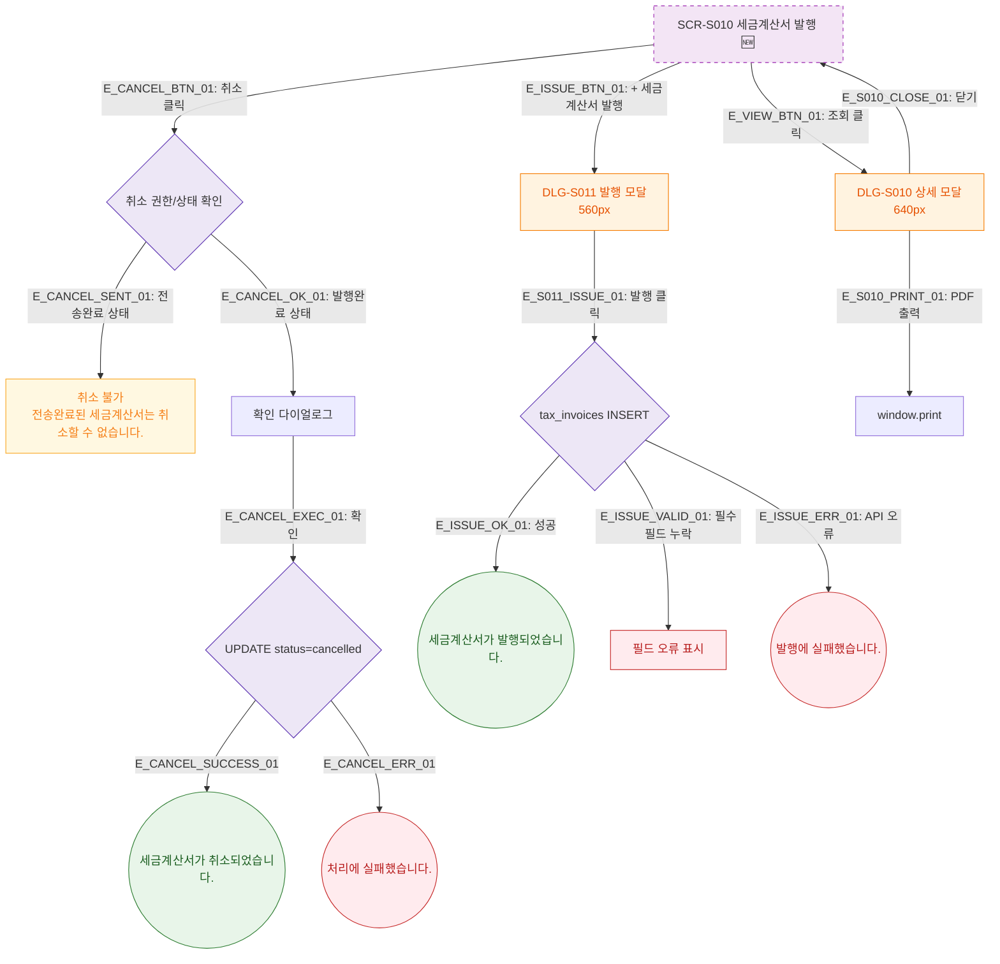

## 1. 목적
세금계산서 발행 화면의 발행/조회/취소 Happy Path. 성공/검증실패/시스템에러 3갈래 분기 포함. 🆕 기획 초안.

## 2. 전제조건
- SCR-S010 진입 완료

## 3. 다이어그램

## 4. 엣지 설명

| 엣지 ID | 출발 | 도착 | 설명 |
|---------|------|------|------|
| E_CANCEL_SENT_01 | CANCEL_AUTH | CANCEL_BLOCKED | 전송완료 → 취소 불가 warning |
| E_ISSUE_OK_01 | ISSUE_EXEC | TOAST_ISSUE_OK | 발행 성공 |
| E_ISSUE_VALID_01 | ISSUE_EXEC | ERR_VALID | 필수필드 누락 |
| E_S010_PRINT_01 | DLG_S010 | PDF_PRINT | PDF 출력 |

## 5. TC 후보

| TC ID | 타입 | Given | When | Then |
|-------|------|-------|------|------|
| TC-S010-F2-01 | positive | 세금계산서 발행 | + 발행 클릭 | DLG-S011 표시 |
| TC-S010-F2-02 | positive | DLG-S011 | 발행 완료 | 성공 토스트 |
| TC-S010-F2-03 | negative | 전송완료 상태 | 취소 클릭 | warning 토스트, 취소 불가 |
| TC-S010-F2-04 | negative | DLG-S011 | 필수필드 미입력 | 필드 오류 표시, 발행 불가 |
