## 1. 목적
SCR-S011 매출 예측(🆕 기획 초안) 진입 경로와 권한 분기를 표현한다.

## 2. 전제조건
- 로그인 완료

## 3. 다이어그램

```mermaid
flowchart TD
    SB([사이드바 > 매출 > 매출 예측 🆕]) -->|E_SB_AUTH_01| AUTH
    URL([직접 URL /sales/forecast]) -->|E_URL_AUTH_01| AUTH

    AUTH{권한 확인}
    AUTH -->|"E_AUTH_PRIMARY_01: primary"| PRIMARY[슈퍼관리자\n전 지점 통합 예측]
    AUTH -->|"E_AUTH_MANAGER_01: owner/manager"| MANAGER[본 지점만]
    AUTH -->|"E_AUTH_TRAINER_01: trainer"| TR_BLOCK[접근 차단]
    AUTH -->|"E_AUTH_FC_01: fc/staff"| FC_BLOCK[접근 차단]

    PRIMARY --> LOAD[예측 데이터 계산\n최소 3개월 필요]
    MANAGER --> LOAD

    LOAD -->|"E_LOAD_OK_01: 데이터 충분"| S011[SCR-S011 매출 예측\n4통계카드 + 차트 + 테이블]
    LOAD -->|"E_LOAD_INSUFFICIENT_01: 3개월 미만"| ERR_DATA[예측에 최소 3개월의 데이터가 필요합니다. 경고]
    LOAD -->|"E_LOAD_ERR_01: API 오류"| ERR((매출 예측 데이터를 생성하지 못했습니다.))

    classDef newFeature fill:#F3E5F5,stroke:#9C27B0,stroke-dasharray:5 5
    classDef error fill:#FFEBEE,stroke:#C62828,color:#B71C1C
    classDef system fill:#EDE7F6,stroke:#5E35B2
    classDef rbacBlocked fill:#F5F5F5,stroke:#9E9E9E,color:#616161
    classDef warning fill:#FFF8E1,stroke:#F9A825,color:#F57F17

    class S011 newFeature
    class ERR error
    class ERR_DATA warning
    class AUTH,LOAD system
    class TR_BLOCK,FC_BLOCK rbacBlocked
```

## 4. 엣지 설명

| 엣지 ID | 출발 | 도착 | 설명 |
|---------|------|------|------|
| E_LOAD_INSUFFICIENT_01 | LOAD | ERR_DATA | 데이터 부족 경고 |
| E_AUTH_TRAINER_01 | AUTH | TR_BLOCK | 트레이너 접근 차단 |

## 5. TC 후보

| TC ID | 타입 | Given | When | Then |
|-------|------|-------|------|------|
| TC-S011-F1-01 | positive | 매니저, 3개월 이상 데이터 | 매출 예측 진입 | 차트+테이블 표시 |
| TC-S011-F1-02 | negative | 매니저, 데이터 2개월 | 매출 예측 진입 | 데이터 부족 경고 토스트 |
