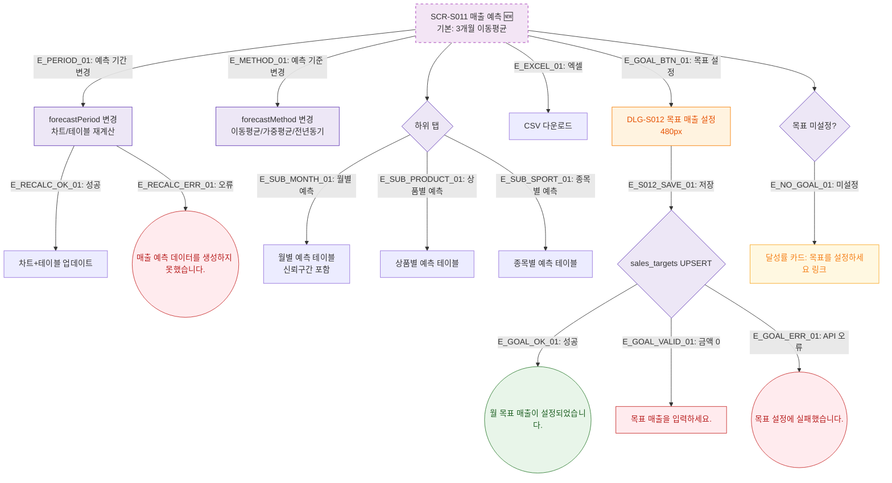

## 1. 목적
매출 예측 화면의 예측 기간/기준 변경, 목표 설정, 탭 전환 Happy Path. 성공/검증실패/시스템에러 3갈래 분기 포함. 🆕 기획 초안.

## 2. 전제조건
- SCR-S011 진입 완료

## 3. 다이어그램

## 4. 엣지 설명

| 엣지 ID | 출발 | 도착 | 설명 |
|---------|------|------|------|
| E_GOAL_BTN_01 | S011 | DLG_S012 | 목표 설정 모달 |
| E_GOAL_OK_01 | GOAL_EXEC | TOAST_GOAL_OK | 목표 설정 성공 |
| E_NO_GOAL_01 | GOAL_STATE | NO_GOAL_LINK | 목표 미설정 안내 링크 |

## 5. TC 후보

| TC ID | 타입 | Given | When | Then |
|-------|------|-------|------|------|
| TC-S011-F2-01 | positive | 매출 예측 | 예측 기간 6개월 변경 | 차트/테이블 재계산 |
| TC-S011-F2-02 | positive | 매출 예측 | 목표 설정 클릭 | DLG-S012 표시 |
| TC-S011-F2-03 | positive | DLG-S012 | 목표 저장 | 성공 토스트 |
| TC-S011-F2-04 | negative | 목표 미설정 | 달성률 카드 확인 | 설정 링크 표시 |
