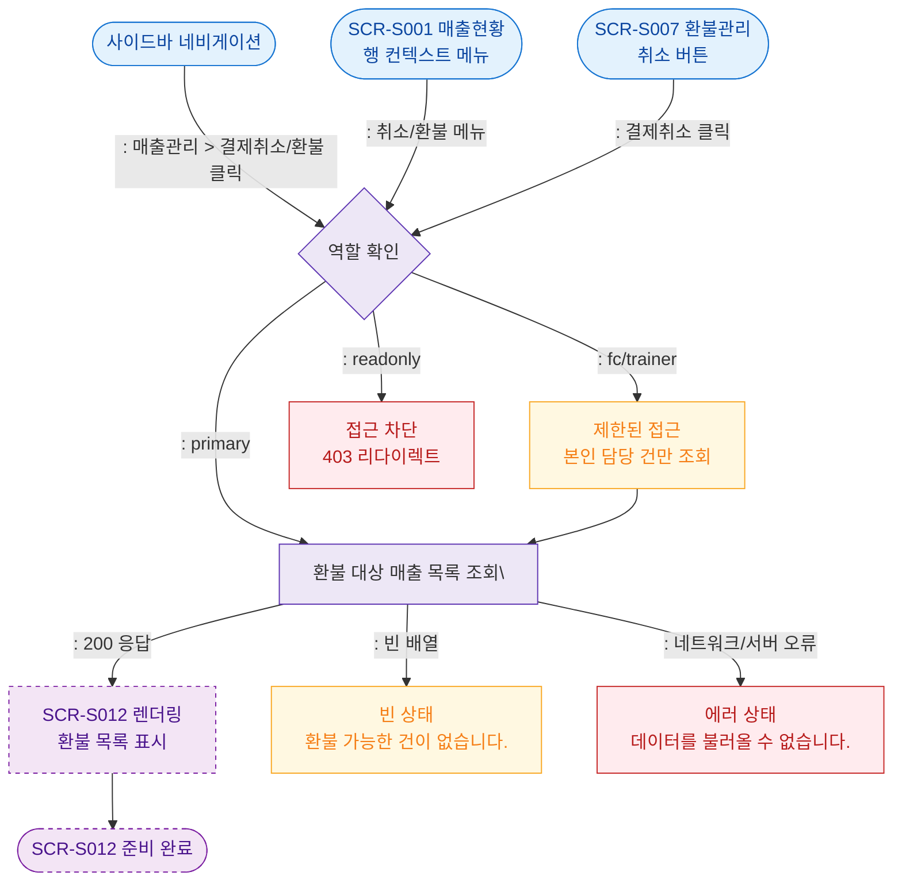

## 1. 목적
SCR-S012 결제취소/부분환불 화면으로의 진입 경로와 초기 데이터 로드 흐름을 표현한다.

## 2. 전제조건
- 로그인 완료
- 역할: primary, owner, manager (trainer/fc는 제한적 접근)

## 3. 다이어그램

## 4. 엣지 설명

| 출발 | 도착 | 설명 | |---------|------|------|------| | | ENTRY_NAV | AUTH_CHECK | 사이드바 직접 진입 | | | ENTRY_S001 | AUTH_CHECK | 매출현황 컨텍스트 메뉴 진입 | | | ENTRY_S007 | AUTH_CHECK | 환불관리에서 취소 클릭 진입 | | | AUTH_CHECK | FETCH_LIST | 관리자급 전체 접근 | | | AUTH_CHECK | FC_LIMIT | fc/trainer 제한 접근 | | | AUTH_CHECK | BLOCKED | readonly 차단 | | | FETCH_LIST | RENDER_S012 | 목록 조회 성공 | | | FETCH_LIST | EMPTY_STATE | 환불 가능 건 없음 | | | FETCH_LIST | ERR_STATE | API 오류 |
