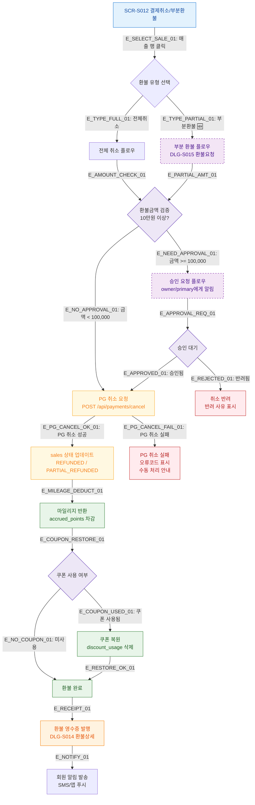

## 1. 목적
SCR-S012의 전체/부분 환불 처리 핵심 플로우를 표현한다. 승인 프로세스(10만원 이상), PG 취소 연동, 마일리지 반환까지 포함한다.

## 2. 전제조건
- SCR-S012 진입 완료
- 환불 대상 매출 선택됨

## 3. 다이어그램

## 4. 엣지 설명

| 엣지 ID | 출발 | 도착 | 설명 |
|---------|------|------|------|
| E_TYPE_FULL_01 | SALE_DETAIL | FULL_REFUND | 전체 취소 선택 |
| E_TYPE_PARTIAL_01 | SALE_DETAIL | PARTIAL_REFUND | 부분 환불 선택 (🆕) |
| E_NEED_APPROVAL_01 | AMOUNT_GATE | APPROVAL_FLOW | 10만원 이상 → 승인 필요 |
| E_NO_APPROVAL_01 | AMOUNT_GATE | PG_CANCEL | 10만원 미만 → 즉시 처리 |
| E_APPROVED_01 | WAIT_APPROVE | PG_CANCEL | 승인 완료 → PG 취소 진행 |
| E_REJECTED_01 | WAIT_APPROVE | REJECTED | 반려 → 취소 불가 |
| E_PG_CANCEL_OK_01 | PG_CANCEL | UPDATE_SALES | PG 취소 성공 |
| E_PG_CANCEL_FAIL_01 | PG_CANCEL | PG_FAIL | PG 취소 실패 |
| E_MILEAGE_DEDUCT_01 | UPDATE_SALES | MILEAGE_RETURN | 마일리지 차감 처리 |
| E_COUPON_USED_01 | COUPON_CHECK | COUPON_RESTORE | 쿠폰 복원 |
| E_RECEIPT_01 | REFUND_COMPLETE | REFUND_RECEIPT | 환불 영수증 발행 |
| E_NOTIFY_01 | REFUND_RECEIPT | NOTIFY_MEMBER | 회원 알림 발송 |

## 5. TC 후보

| TC ID | 타입 | Given | When | Then |
|-------|------|-------|------|------|
| TC-S012-F2-01 | positive | 5만원 결제 건 | 전체 취소 | 즉시 PG 취소, 환불 완료 |
| TC-S012-F2-02 | positive | 15만원 결제 건 | 전체 취소 | 승인 요청 발송, 대기 상태 |
| TC-S012-F2-03 | positive | 승인 대기 중 | owner 승인 | PG 취소 진행 → 완료 |
| TC-S012-F2-04 | negative | 승인 대기 중 | owner 반려 | 취소 반려 처리 |
| TC-S012-F2-05 | positive | 쿠폰 사용 건 | 환불 처리 | 쿠폰 복원 + 마일리지 차감 |
| TC-S012-F2-06 | exception | 환불 처리 | PG 취소 실패 | 오류 코드 표시, 수동 처리 안내 |
