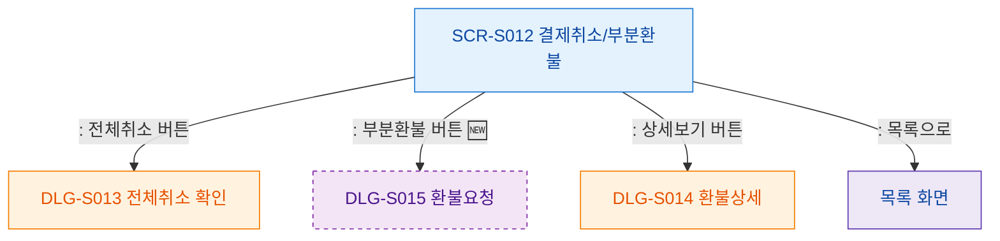

## 1. 목적
SCR-S012의 버튼별 액션 흐름을 표현한다.

## 2. 전제조건
- SCR-S012 진입 완료

## 3. 다이어그램

## 4. 엣지 설명

| 출발 | 도착 | 설명 | |---------|------|------|------| | | S012 | CONFIRM_FULL | 전체취소 확인 모달 | | | S012 | CONFIRM_PARTIAL | 부분환불 요청 모달 (🆕) | | | S012 | VIEW_DETAIL | 환불 상세 모달 | | | S012 | BACK_LIST | 목록으로 복귀 |
